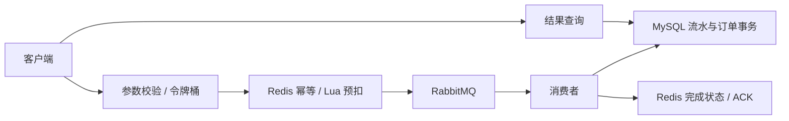

# seckill-system

一个从单体 MySQL 逐步演进到 Redis + RabbitMQ 的 Java 秒杀教学项目。实现库存预扣、异步下单、请求幂等、令牌桶限流，并保留每阶段完整代码、测试和原始 JMeter 证据。

**技术栈：Java 21 · Spring Boot 3.3.5 · MyBatis · MySQL 8.0.46 · Redis + Lua · RabbitMQ · Docker Compose。**

阶段五已验收并推送（`866bd0f`）。阶段六新增登录认证与订单归属校验，当前本地交付等待验收：[阶段六说明](docs/stage6.md)、[66 项测试](docs/stage6-test-results.txt)、[压测报告](docs/stage6-report.md)。

阶段六独立演示入口为 `http://localhost:18082/api`，使用 `compose.stage6.yaml`。注册/登录后下单只传 Bearer Token 和 Idempotency-Key，不再传 userId。完整启动和 PowerShell 验收命令见阶段六说明；下方原有 18081 快速启动保留为阶段五教学基线。

## 项目能力

- 阶段六：带盐密码哈希、Redis 短期会话、当前会话退出、登录限流、订单与异步结果本人归属校验。

- Redis Lua 原子库存预扣；商品缓存缺失时停止售卖，不自动从旧数据库库存补满。
- RabbitMQ 发布确认、消费事务、有限重试与死信；HTTP 202 表示受理，结果查询 SUCCESS 才表示成交。
- 同一 userId + Idempotency-Key 重试返回原请求，MySQL 请求流水处理重复消息。
- 全局/IP/用户令牌桶限流，查询接口也受保护；429 返回 Retry-After。
- 统一错误响应、HTTP traceId 与业务 requestId 日志关联、日志滚动与健康检查。
- 非 root Docker 应用、独立数据卷、依赖健康等待和一次性库存初始化。

## 架构



[完整架构图与一致性说明](docs/architecture.md) · [部署和排错手册](docs/deployment.md)

## 快速启动：独立 Docker 演示

需要 JDK 21、Python 3 和 Docker Engine/Compose。PowerShell 在项目根目录执行：

```powershell
.\mvnw.cmd -DskipTests "-Dseckill.build-name=seckill-system-stage5" package
python scripts/init-docker-env.py
docker build -t seckill-system:stage5 .
docker compose up -d --wait --wait-timeout 240
```

Linux/macOS 构建改用 `sh ./mvnw -DskipTests -Dseckill.build-name=seckill-system-stage5 package`。如果 Docker 仅安装在 WSL 中，请使用 [已验证的 WSL 命令](docs/deployment.md#本机-windows--wsl-的实际命令)。

访问 `http://localhost:18081/api/actuator/health`，预期 UP。容器初始化自己的商品 1，初始库存 100；本机自动验收已购买一件时库存为 99。这套数据与原 Windows/WSL 服务、8081 应用隔离。

.env 由脚本生成随机凭据且不覆盖已有文件，已被 Git 忽略。不要把真实凭据写入仓库。数据库、Redis 和 MQ 不对宿主机映射端口。详细启动顺序、数据卷与故障处理见部署手册。

## 下单与重试

```powershell
$headers = @{ 'Idempotency-Key' = [guid]::NewGuid().ToString() }
$r = Invoke-RestMethod -Method Post -Headers $headers 'http://localhost:18081/api/seckill/1?userId=1001'
$r
Start-Sleep -Seconds 1
Invoke-RestMethod "http://localhost:18081/api/seckill/result/$($r.requestId)"
Invoke-RestMethod -Method Post -Headers $headers 'http://localhost:18081/api/seckill/1?userId=1001'
```

一次购买操作只有一个键，网络重试必须复用；换新键会被视为新的购买操作。相同键不能更换商品。

| 接口 | 说明 |
|---|---|
| GET /api/product/{id} | 查询实时 Redis 库存 |
| POST /api/seckill/{productId}?userId=... | 必须携带 UUID 请求头 Idempotency-Key |
| GET /api/seckill/result/{requestId} | 查询 PENDING / SUCCESS / UNKNOWN / REVIEW_REQUIRED |
| GET /api/order/{id} | 查询已创建订单 |
| GET /api/actuator/health | 整体健康，无内部连接明细 |

首次成功受理返回 202 + requestId；同键重试可能返回 202/PENDING 或 200/SUCCESS。400 为参数错误，409 为售罄/键冲突，429 为限流，503 为不可用或不确定。UNKNOWN 不应换键重下；保留编号并核查。

## 使用现有本机服务

凭据放入被忽略的 application-local.properties。沿用前面阶段已准备的表和 Redis 库存，停止占用 8081 的旧应用后运行：

```powershell
java -jar target/seckill-system-stage5.jar --spring.profiles.active=stage5
```

完整文件和首次建库说明在各阶段文档中。不要把已迁移商品切回 MySQL 扣库存模式，也不要从 product.stock 基线覆盖实时 Redis 库存。

## 测试与压测

默认测试会跳过需要外部组件的集成测试。使用本机测试数据库/Redis/MQ，开启全部验证：

```powershell
$env:SECKILL_MYSQL_TEST='true'
$env:SECKILL_REDIS_TEST='true'
$env:SECKILL_MQ_TEST='true'
$env:SECKILL_PROTECTION_TEST='true'
$env:SECKILL_ENGINEERING_TEST='true'
$env:SECKILL_AUTH_TEST='true'
.\mvnw.cmd test
```

已执行 66 项测试，失败/错误/跳过均为 0。测试用独立商品和队列，但会在指定数据库中建表与写入测试数据，只在开发/测试环境执行。

JMeter 5.6.3 放在 target/tools/apache-jmeter-5.6.3，Python 需要 psutil。先完成打包，再运行：

```powershell
python perf/run_stage6.py --requests 10000
```

脚本创建独立商品、使用 18090 端口，对比同一阶段六 JAR 的 stage5/stage6 配置（预建登录态，下单身份池相同，排除密码哈希开销），记录原始 JTL、QPS、响应时间、429、最终订单、MySQL 状态、CPU 和队列采样。运行前停止独立 Docker 演示容器以减少干扰，结束后可恢复。压测工具位于 target，执行 Maven clean 会删除它，需要重新准备。

本项目保留短时探索性实测，**不把 HTTP 202 或快速 429 当作最终成交吞吐，也不宣称单轮实验等于生产容量**。

## 学习路径与证据

| 阶段 | 能力 | 资料 |
|---|---|---|
| 一 | MySQL 单体、事务扣库存与订单 | [完整代码](docs/stage1-source.md) / [报告](docs/stage1-report.md) |
| 二 | Redis + Lua 库存预扣 | [说明](docs/stage2.md) / [报告](docs/stage2-report.md) |
| 三 | RabbitMQ 异步、确认与消息去重 | [说明](docs/stage3.md) / [报告](docs/stage3-report.md) |
| 四 | 限流、防刷与请求幂等 | [说明](docs/stage4.md) / [报告](docs/stage4-report.md) |
| 五 | 日志、异常、Docker 与项目整理 | [说明](docs/stage5.md) / [完整代码](docs/stage5-source.md) / [报告](docs/stage5-report.md) |
| 六 | 登录认证与订单归属校验 | [说明](docs/stage6.md) / [完整代码](docs/stage6-source.md) / [报告](docs/stage6-report.md) |

[全部实验索引](docs/experiments.md) · [源码 ZIP 与 SHA256 清单](docs/baselines/)

Java 包始终为 com.ddk.seckill，主目录保持 controller / service / entity / mapper / SeckillApplication.java。部署文件位于 deploy，压测位于 perf，文档位于 docs。

## 尚未解决的问题

阶段六已校验登录身份和资源归属；阶段一至五保留无认证教学入口，不能与阶段六一起向业务用户开放。阶段六仍无密码找回、账号封禁、MFA、全会话撤销与 HTTPS 终止配置。Redis 与 MQ 没有跨系统事务，未决预扣/死信仍需人工对账；Redis AOF everysec 和单节点部署不保证任意故障下零丢失。永久幂等记录需要归档策略，当前多 key Lua 不能直接跨 Redis Cluster 槽使用。

Docker 验收覆盖保留数据卷的容器重建，没有覆盖断电恢复、集群高可用或备份恢复。普通 `docker compose down` 保留卷；添加 `-v` 会删除数据，不要用于保留演示记录的重启操作。
