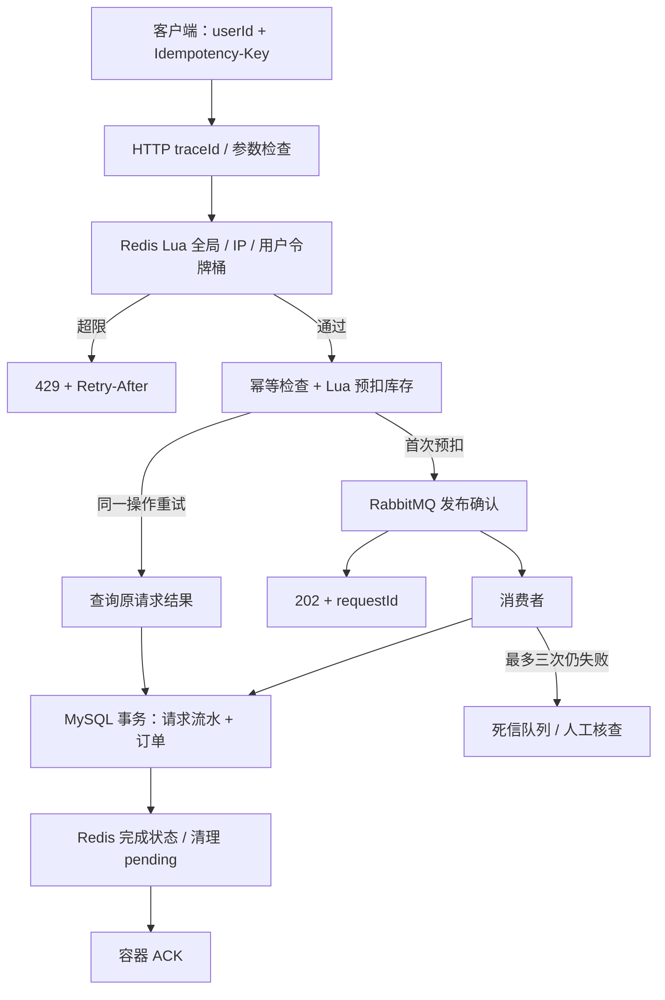
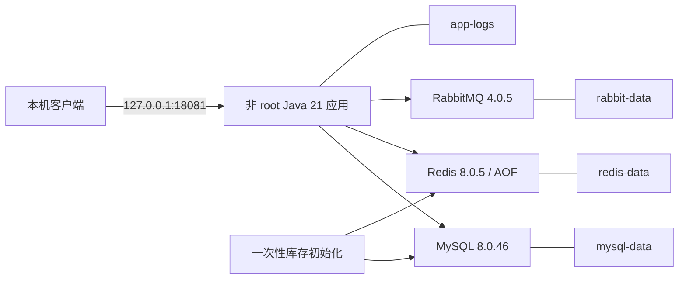

# 系统架构与一致性边界

## 数据职责
- MySQL product.stock：阶段二开始作为初始化基线，不代表实时可售库存。
- Redis product_stock_{id}：实时库存；product_info_{id}：商品快照；product_pending_{id}：未完成预扣。
- Redis seckill_request_{requestId}：请求 payload 与处理状态，成功后七天过期。
- Redis seckill_idempotency_{requestId}：userId:productId 参数指纹，不自动过期。
- MySQL seckill_async_order：request_id 主键去重，同事务绑定唯一 order_id。
- MySQL seckill_order：已成交业务订单。

## 正确理解确认
publisher confirm 说明 broker 接收了消息；mandatory return 检查能否路由到队列；消费者方法成功返回后 Spring 容器 ACK。HTTP 202 不是最终订单成功。客户端用 requestId 查询到 SUCCESS 才是成交结果。

## 日志关联
每次 HTTP 请求生成新的 X-Trace-Id，错误体携带相同 traceId。首次下单的 submission queued 日志把 HTTP traceId 与业务 requestId 关联；消费者用 requestId 放入 MDC，并记录 orderId。重试有不同的 HTTP traceId，但业务 requestId 相同。MDC 作用于当前线程，消费者显式设置并在结束时清理；没有引入分布式追踪平台。

访问日志记录路由模板、方法、状态和耗时，不记录原始查询串、请求体、密码或 Idempotency-Key。异常堆栈只记录在服务端；正常 API 错误体不返回内部 SQL 或异常类名。

## Docker 部署

Compose 先等三个依赖健康，再运行 bootstrap 初始化库存，成功后启动 app。bootstrap 已存在基线时只读取 Redis，绝不按旧 MySQL 库存补满。依赖健康条件只控制启动，运行期间的故障仍由应用处理。数据卷隔离于原 Windows/WSL 本机服务。

## 当前可靠性边界
Redis 预扣与 MQ 发布之间没有原子事务；预扣后崩溃可能留下 PENDING。MQ 超时和死信不能盲目补库存或换新键下单。数据库提交与 Redis 清理之间也存在失败窗口，数据库流水是订单最终结果依据。Redis AOF everysec、单节点 RabbitMQ/classic 队列与 MySQL 均不提供跨节点高可用。

结果接口和 userId 尚无登录归属验证；限流不能替代认证或边缘流量保护。永久幂等标记还需要设计持久化归档和保留期。工程化阶段没有消除这些业务一致性与身份边界。
