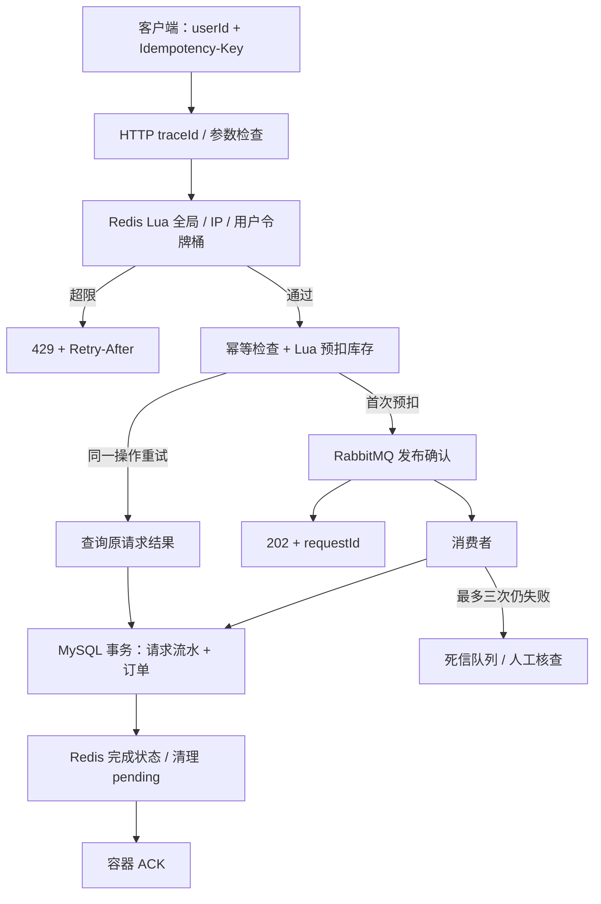
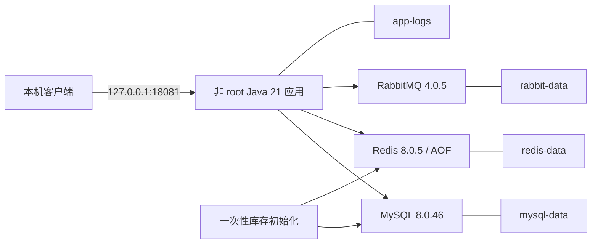
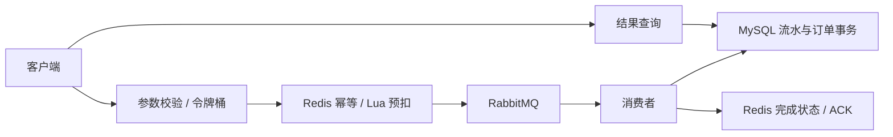

# 阶段五完整代码与配置

本文件收录实际工作区完整文件，可按路径保存；所有配置使用环境变量引用，本机凭据不收录。设计、启动与测试见 [阶段说明](stage5.md) 和 [部署手册](deployment.md)。

## .dockerignore

作用：提供项目启动、构建或文件管理配置。

````text
**
!Dockerfile
!target/
target/*
!target/seckill-system-stage5.jar
````

## .env.example

作用：提供项目启动、构建或文件管理配置。

````text
# Copy or run scripts/init-docker-env.py. Use distinct random values; never commit .env.
MYSQL_ROOT_PASSWORD=replace-with-random-root-password
APP_DB_PASSWORD=replace-with-random-app-password
MQ_PASSWORD=replace-with-random-mq-password
````

## .gitattributes

作用：提供项目启动、构建或文件管理配置。

````text
/mvnw text eol=lf
*.cmd text eol=crlf

# Preserve benchmark evidence and historical snapshots byte-for-byte.
/perf/results/** -text whitespace=cr-at-eol
/docs/baselines/** -text whitespace=cr-at-eol
/docs/stage1-report.md -text whitespace=cr-at-eol
/docs/stage1-source.md -text whitespace=-blank-at-eol,cr-at-eol

/docs/stage2-report.md -text whitespace=cr-at-eol
/docs/stage2-source.md -text whitespace=-blank-at-eol,cr-at-eol
/docs/stage2-test-results.txt -text whitespace=cr-at-eol
/docs/stage2-restart-check.json -text whitespace=cr-at-eol

/docs/stage3-report.md -text whitespace=cr-at-eol
/docs/stage3-source.md -text whitespace=-blank-at-eol,cr-at-eol
/docs/stage3-test-results.txt -text whitespace=cr-at-eol

/docs/stage4-report.md -text whitespace=cr-at-eol
/docs/stage4-source.md -text whitespace=-blank-at-eol,cr-at-eol
/docs/stage4-test-results.txt -text whitespace=cr-at-eol

/docs/stage5-report.md -text whitespace=cr-at-eol
/docs/stage5-source.md -text whitespace=-blank-at-eol,cr-at-eol
/docs/stage5-test-results.txt -text whitespace=cr-at-eol
/docs/stage5-docker-check.json -text whitespace=cr-at-eol
````

## .gitignore

作用：提供项目启动、构建或文件管理配置。

````text
HELP.md
target/
.mvn/wrapper/maven-wrapper.jar
!**/src/main/**/target/
!**/src/test/**/target/

### STS ###
.apt_generated
.classpath
.factorypath
.project
.settings
.springBeans
.sts4-cache

### IntelliJ IDEA ###
.idea
*.iws
*.iml
*.ipr

### NetBeans ###
/nbproject/private/
/nbbuild/
/dist/
/nbdist/
/.nb-gradle/
build/
!**/src/main/**/build/
!**/src/test/**/build/

### VS Code ###
.vscode/

# Local credentials and Python cache
/application-local.properties
.env
__pycache__/
*.pyc

# Runtime log files and local deployment state
/logs/
````

## compose.yaml

作用：编排独立数据库、缓存、消息队列及应用。

````yaml
name: seckill-demo
x-app-environment: &app-environment
  SPRING_PROFILES_ACTIVE: stage5,docker
  SPRING_DATASOURCE_PASSWORD: ${APP_DB_PASSWORD:?Run python scripts/init-docker-env.py first}
  SPRING_RABBITMQ_PASSWORD: ${MQ_PASSWORD:?Run python scripts/init-docker-env.py first}
  TZ: Asia/Shanghai
services:
  mysql:
    image: mysql:8.0.46
    environment:
      MYSQL_DATABASE: seckill
      MYSQL_USER: seckill
      MYSQL_PASSWORD: ${APP_DB_PASSWORD:?Missing APP_DB_PASSWORD}
      MYSQL_ROOT_PASSWORD: ${MYSQL_ROOT_PASSWORD:?Missing MYSQL_ROOT_PASSWORD}
      TZ: Asia/Shanghai
    volumes:
      - mysql-data:/var/lib/mysql
      - ./deploy/mysql:/docker-entrypoint-initdb.d:ro
    healthcheck:
      test: [CMD-SHELL, 'MYSQL_PWD="$$MYSQL_PASSWORD" mysql -h 127.0.0.1 -u seckill -D seckill -e "SELECT 1" >/dev/null 2>&1']
      interval: 5s
      timeout: 5s
      retries: 30
      start_period: 30s
    mem_limit: 1g
    restart: unless-stopped
  redis:
    image: redis:8.0.5
    command: [redis-server, --appendonly, 'yes', --appendfsync, everysec, --maxmemory, 256mb, --maxmemory-policy, noeviction]
    volumes:
      - redis-data:/data
    healthcheck:
      test: [CMD, redis-cli, ping]
      interval: 5s
      timeout: 3s
      retries: 12
    mem_limit: 384m
    restart: unless-stopped
  rabbitmq:
    image: rabbitmq:4.0.5-management
    hostname: seckill-rabbit
    environment:
      RABBITMQ_DEFAULT_USER: seckill
      RABBITMQ_DEFAULT_PASS: ${MQ_PASSWORD:?Missing MQ_PASSWORD}
      RABBITMQ_DEFAULT_VHOST: seckill
    volumes:
      - rabbit-data:/var/lib/rabbitmq
    healthcheck:
      test: [CMD, rabbitmq-diagnostics, -q, ping]
      interval: 10s
      timeout: 5s
      retries: 12
      start_period: 20s
    mem_limit: 768m
    restart: unless-stopped
  bootstrap:
    build: .
    image: seckill-system:stage5
    environment: *app-environment
    command: [--spring.main.web-application-type=none, --seckill.initialize-product=1, --seckill.consumer-enabled=false]
    depends_on:
      mysql: {condition: service_healthy}
      redis: {condition: service_healthy}
      rabbitmq: {condition: service_healthy}
    mem_limit: 512m
    restart: 'no'
  app:
    image: seckill-system:stage5
    environment: *app-environment
    ports:
      - '127.0.0.1:18081:8081'
    volumes:
      - app-logs:/app/logs
    depends_on:
      bootstrap: {condition: service_completed_successfully}
    healthcheck:
      test: [CMD, curl, -fsS, http://localhost:8081/api/actuator/health]
      interval: 10s
      timeout: 3s
      retries: 12
      start_period: 30s
    mem_limit: 768m
    stop_grace_period: 30s
    restart: unless-stopped
volumes:
  mysql-data:
  redis-data:
  rabbit-data:
  app-logs:
````

## deploy/mysql/001-schema.sql

作用：定义数据库结构或测试初始化数据。

````sql
-- Only executed by MySQL on a NEW Docker data volume. Never runs against the host database.
CREATE TABLE product (
 id BIGINT NOT NULL AUTO_INCREMENT PRIMARY KEY,
 name VARCHAR(255) NOT NULL,
 stock INT NOT NULL,
 price DECIMAL(10,2) NOT NULL,
 CONSTRAINT chk_product_stock CHECK (stock>=0)
) ENGINE=InnoDB DEFAULT CHARSET=utf8mb4;
INSERT INTO product(id,name,stock,price) VALUES (1,'Docker demo iPhone',100,6999.00);

-- Execute against database seckill. Existing product rows are not modified.
-- Verify product uses InnoDB and id is its primary key before running the app.
SHOW CREATE TABLE product;
CREATE TABLE IF NOT EXISTS seckill_order (
    id BIGINT NOT NULL AUTO_INCREMENT PRIMARY KEY,
    user_id BIGINT NOT NULL,
    product_id BIGINT NOT NULL,
    quantity INT NOT NULL DEFAULT 1,
    price DECIMAL(10,2) NOT NULL,
    created_at DATETIME NOT NULL,
    INDEX idx_order_product (product_id),
    CONSTRAINT chk_order_quantity CHECK (quantity = 1),
    CONSTRAINT chk_order_user CHECK (user_id > 0)
) ENGINE=InnoDB DEFAULT CHARSET=utf8mb4;

-- Run once before stage2. Existing product and order rows are unchanged.
CREATE TABLE IF NOT EXISTS seckill_stock_baseline (
    product_id BIGINT NOT NULL PRIMARY KEY,
    initial_stock INT NOT NULL,
    initial_order_quantity BIGINT NOT NULL,
    created_at TIMESTAMP NOT NULL DEFAULT CURRENT_TIMESTAMP,
    CONSTRAINT chk_baseline_stock CHECK (initial_stock >= 0)
) ENGINE=InnoDB DEFAULT CHARSET=utf8mb4;

-- Consumer deduplication and final result; existing orders remain unchanged.
CREATE TABLE IF NOT EXISTS seckill_async_order (
    request_id CHAR(36) CHARACTER SET ascii COLLATE ascii_bin NOT NULL PRIMARY KEY,
    product_id BIGINT NOT NULL,
    user_id BIGINT NOT NULL,
    price DECIMAL(10,2) NOT NULL,
    order_id BIGINT NULL,
    created_at DATETIME NOT NULL,
    UNIQUE KEY uk_async_order (order_id),
    KEY idx_async_product (product_id)
) ENGINE=InnoDB DEFAULT CHARSET=utf8mb4;
````

## Dockerfile

作用：构建以非 root 用户运行的 Java 应用镜像。

````text
FROM eclipse-temurin:21-jre-jammy
WORKDIR /app
RUN command -v curl >/dev/null \
    && groupadd --gid 10001 app \
    && useradd --uid 10001 --gid app --no-create-home --shell /usr/sbin/nologin app \
    && mkdir -p /app/logs && chown 10001:10001 /app/logs
COPY --chown=10001:10001 target/seckill-system-stage5.jar /app/app.jar
USER 10001:10001
EXPOSE 8081
ENTRYPOINT ["java","-XX:MaxRAMPercentage=70.0","-jar","/app/app.jar"]
````

## docs/architecture.md

作用：提供项目设计、部署或验收说明。

````markdown
# 系统架构与一致性边界



## 数据职责
- MySQL product.stock：阶段二开始作为初始化基线，不代表实时可售库存。
- Redis product_stock_{id}：实时库存；product_info_{id}：商品快照；product_pending_{id}：未完成预扣。
- Redis seckill_request_{requestId}：请求 payload 与处理状态，成功后七天过期。
- Redis seckill_idempotency_{requestId}：userId:productId 参数指纹，不自动过期。
- MySQL seckill_async_order：request_id 主键去重，同事务绑定唯一 order_id。
- MySQL seckill_order：已成交业务订单。

## 正确理解确认
publisher confirm 说明 broker 接收了消息；mandatory return 检查能否路由到队列；消费者方法成功返回后 Spring 容器 ACK。HTTP 202 不是最终订单成功。客户端用 requestId 查询到 SUCCESS 才是成交结果。

## 日志关联
每次 HTTP 请求生成新的 X-Trace-Id，错误体携带相同 traceId。首次下单的 submission queued 日志把 HTTP traceId 与业务 requestId 关联；消费者用 requestId 放入 MDC，并记录 orderId。重试有不同的 HTTP traceId，但业务 requestId 相同。MDC 作用于当前线程，消费者显式设置并在结束时清理；没有引入分布式追踪平台。

访问日志记录路由模板、方法、状态和耗时，不记录原始查询串、请求体、密码或 Idempotency-Key。异常堆栈只记录在服务端；正常 API 错误体不返回内部 SQL 或异常类名。

## Docker 部署


Compose 先等三个依赖健康，再运行 bootstrap 初始化库存，成功后启动 app。bootstrap 已存在基线时只读取 Redis，绝不按旧 MySQL 库存补满。依赖健康条件只控制启动，运行期间的故障仍由应用处理。数据卷隔离于原 Windows/WSL 本机服务。

## 当前可靠性边界
Redis 预扣与 MQ 发布之间没有原子事务；预扣后崩溃可能留下 PENDING。MQ 超时和死信不能盲目补库存或换新键下单。数据库提交与 Redis 清理之间也存在失败窗口，数据库流水是订单最终结果依据。Redis AOF everysec、单节点 RabbitMQ/classic 队列与 MySQL 均不提供跨节点高可用。

结果接口和 userId 尚无登录归属验证；限流不能替代认证或边缘流量保护。永久幂等标记还需要设计持久化归档和保留期。工程化阶段没有消除这些业务一致性与身份边界。
````

## docs/deployment.md

作用：提供项目设计、部署或验收说明。

````markdown
# 部署与排错手册

## 本机 Java 模式
需要 Java 21、现有 MySQL 8.0.46、Redis、RabbitMQ，以及 application-local.properties 中的本机凭据。先完成阶段一至三建表/库存初始化。

PowerShell：
```powershell
.\mvnw.cmd -DskipTests "-Dseckill.build-name=seckill-system-stage5" package
java -jar target/seckill-system-stage5.jar --spring.profiles.active=stage5
```
停止原来占用 8081 的应用后再启动；如果同名 JAR 正在运行，先停止再重新构建，避免 Windows 文件锁。商品沿用现有 Redis 库存，不要重新初始化为 100。

## Docker 快速启动（通用环境）
前提：JDK 21、Python 3、可用的 Docker Engine/Compose。Windows 构建命令如上；Linux/macOS 使用 `sh ./mvnw -DskipTests -Dseckill.build-name=seckill-system-stage5 package`。
```text
python scripts/init-docker-env.py
docker compose config --quiet
docker build -t seckill-system:stage5 .
docker compose up -d --wait --wait-timeout 240
```
.env 生成随机数据库/root/MQ 密码且不覆盖已有文件。它和 application-local.properties 均被 Git 忽略；.dockerignore 只允许构建产物 JAR 和 Dockerfile 进入上下文，不包含本机凭据。

首次启动时 MySQL 空数据卷执行 deploy/mysql/001-schema.sql，创建完整表结构和 Docker 演示商品 1（库存 100）。bootstrap 离线初始化 Redis；成功后 app 才启动。MySQL、Redis、RabbitMQ 不映射宿主机端口；应用仅映射 127.0.0.1:18081。

示例环境使用固定教学版本；Java 21 基础镜像的实际摘要记录在验收报告中。Compose 中密码通过环境变量注入，可被有 Docker 管理权限的人读取；此方式用于本地演示，正式部署需改用组织的密钥管理和备份策略。

## 本机 Windows + WSL 的实际命令
已在 Ubuntu 中安装 Docker Engine/Compose，数据目录属于 WSL。PowerShell 在 C:\seckill-system 执行：
```powershell
wsl -d Ubuntu -u root --exec /usr/sbin/service docker start
python scripts/init-docker-env.py
wsl -d Ubuntu -u root --cd /mnt/c/seckill-system --exec /usr/bin/docker compose config --quiet
wsl -d Ubuntu -u root --cd /mnt/c/seckill-system --exec /usr/bin/docker compose up -d --pull never --wait --wait-timeout 240
```
本次官方镜像直连超时，经现有 Windows 本机代理下载、逐层校验摘要并导入了 Docker；本机所需镜像已在缓存中，所以以上启动命令使用 --pull never。镜像来源与摘要见 stage5-docker-check.json。没有修改系统代理监听范围。

本机已成功构建应用镜像。需要重新构建时先生成新 JAR，然后：
```powershell
wsl -d Ubuntu -u root --cd /mnt/c/seckill-system --exec /usr/bin/env DOCKER_BUILDKIT=0 /usr/bin/docker build --pull=false -t seckill-system:stage5 .
wsl -d Ubuntu -u root --cd /mnt/c/seckill-system --exec /usr/bin/docker compose up -d --pull never --wait --wait-timeout 240
```
这里的 legacy builder 是本次离线本地镜像构建兼容方式，Docker 已提示弃用；网络和 BuildKit 正常的环境优先使用前面的通用构建命令。`--pull never` 不能用于缺失基础服务镜像的新机器。

## 健康检查和手工验收
```powershell
Invoke-RestMethod 'http://localhost:18081/api/actuator/health'
Invoke-RestMethod 'http://localhost:18081/api/product/1'
$headers = @{ 'Idempotency-Key' = [guid]::NewGuid().ToString() }
$r = Invoke-RestMethod -Method Post -Headers $headers 'http://localhost:18081/api/seckill/1?userId=1001'
Start-Sleep -Seconds 1
Invoke-RestMethod "http://localhost:18081/api/seckill/result/$($r.requestId)"
Invoke-RestMethod -Method Post -Headers $headers 'http://localhost:18081/api/seckill/1?userId=1001'
```
健康应为 UP，查询最终订单应为 SUCCESS，同一键重试不再次扣库存。18081 使用独立 Docker 数据，不是原来 8081 的商品数据。

`/api/actuator/health/liveness` 表示应用进程存活；`/api/actuator/health/readiness` 包含数据库、Redis、RabbitMQ 可用性。只有 health 被公开，不公开 env、配置或指标端点。健康响应不含依赖连接明细；健康不代表消息积压已清空，也不代表库存已完成对账。

自动容器验收：先 `python scripts/smoke-stage5.py --mode capture`；保留数据卷重建容器后运行 `--mode replay`。脚本固定 18081，并把重试键保存在 target，已有记录时拒绝再次 capture，以免意外增加购买。

## 日志与异常
```powershell
wsl -d Ubuntu -u root --cd /mnt/c/seckill-system --exec /usr/bin/docker compose logs --tail 100 app
wsl -d Ubuntu -u root --cd /mnt/c/seckill-system --exec /usr/bin/docker compose logs --tail 100 bootstrap
```
本机文件 logs/seckill.log；容器文件 /app/logs/seckill.log，保存于 app-logs 命名卷。单文件 20MB、历史七天、归档总量 200MB（当前活动文件另计）。日志滚动配置已启用，本轮短时测试不验证七天保留行为。

错误体包含 timestamp、status、code、message、traceId；用 X-Trace-Id 对应服务端日志定位异常。400 表示参数/请求头问题，409 表示售罄或幂等键冲突，429 遵守 Retry-After，503 表示依赖不可用或操作不确定。业务 UNKNOWN 响应仍保留 requestId/status/orderId，便于后续查询，不包装成丢失业务编号的错误体。

排错顺序：先确认 profile 和端口 → health → app/依赖日志 → 用 traceId 找 HTTP 记录 → 用 requestId 找消息和订单流水。不要把“正在排队”和“请求失败”混为一谈。

## 停止、重启与数据
```text
docker compose stop
docker compose start --wait
docker compose down
docker compose up -d --wait
```
普通 down 删除该项目容器/网络，保留命名卷。**不要加 -v**，否则会删除演示数据库、库存和日志。首次数据库初始化脚本不会在已有数据卷上再次执行；后续表结构升级需单独设计迁移。本次只验证保留卷的容器重建，没有模拟断电、存储损坏或跨机器恢复。

如 Redis 卷丢失但 MySQL 基线仍在，bootstrap 会拒绝自动补库存；必须停写并根据订单及未决请求离线对账。不要删除基线表绕过检查。

## 运行边界
单节点部署、无登录认证、Redis/MQ 跨系统事务窗口和人工对账问题仍存在；Redis 未设密码但不对宿主机暴露端口，仅用于隔离的 Compose 网络。用于公开展示和本机学习，不能直接当作公网生产部署。

参考：[Compose 启动依赖条件](https://docs.docker.com/compose/how-tos/startup-order/)、[Compose 服务定义](https://docs.docker.com/reference/compose-file/services/)。
````

## docs/stage5.md

作用：提供项目设计、部署或验收说明。

````markdown
# 阶段五：项目工程化

## 1. 阶段目标
在阶段四可运行、可限流、可幂等的业务基础上，补齐定位故障和复现部署需要的工程能力。交付轻量日志关联、统一异常、健康检查、Docker Compose、README、架构图和完整实验资料。

## 2. 设计原因
HTTP 每次请求有独立 traceId，MQ 使用业务 requestId 关联订单，可从错误响应追到服务端日志。统一错误体保留 HTTP 状态和 Retry-After，不暴露 SQL/堆栈；业务 UNKNOWN 继续保留请求编号，避免破坏异步查询语义。

日志记录路由模板而非原始查询串，控制敏感数据和日志注入风险；文件按大小/时间滚动，避免无限增长。文件日志与访问日志有 CPU/IO 成本，必须实测。

健康检查区分进程存活与依赖就绪，只公开 health。Compose 按“依赖健康 → 离线初始化成功 → 应用健康”启动，避免只启动进程却尚不能访问数据库。应用以 UID 10001 运行；独立命名卷持久化数据与日志。

## 3. 文件修改
新增：
- src/main/java/com/ddk/seckill/entity/ApiError.java：结构化错误响应。
- src/main/java/com/ddk/seckill/controller/ApiExceptionHandler.java：状态映射、错误隐藏、保留 Retry-After/Allow。
- src/main/java/com/ddk/seckill/controller/RequestTraceFilter.java：X-Trace-Id、MDC 生命周期和 HTTP 访问日志。
- src/main/resources/application-stage5.properties：日志、健康和优雅停机配置，沿用阶段四保护。
- src/main/resources/application-docker.properties：容器内服务名和数据源配置。
- src/test/java/com/ddk/seckill/EngineeringIntegrationTest.java：新增十一项异常、日志和健康验证。
- Dockerfile、.dockerignore、compose.yaml、.env.example、deploy/mysql/001-schema.sql：镜像、隔离环境和空卷初始化。
- scripts/init-docker-env.py、scripts/smoke-stage5.py：本地随机凭据及容器验收。
- perf/run_stage5.py、perf/report_stage5.py：同条件工程化配置对比。
- docs/architecture.md、docs/deployment.md、docs/stage5-source.md、docs/stage5-report.md、docs/stage5-test-results.txt、docs/stage5-docker-check.json、docs/baselines/stage5-*：教学、运维、源码和证据。

修改：pom.xml 增加 Actuator；service/AsyncOrderConsumer.java 与 service/ProtectedSeckillService.java 增加业务日志关联；README.md 重整项目入口；.gitignore 排除运行日志；.gitattributes 和 docs/experiments.md 维护证据规则/索引。未改变包名和四个 Java 主子目录。

## 4. 完整代码
所有当前主代码、工程化测试、配置与部署文件的完整内容见 [stage5-source.md](stage5-source.md)。本机凭据不收录。可复现源码 ZIP 和 SHA256 清单位于 docs/baselines。

## 5. 启动与接口测试
[部署手册](deployment.md) 提供本机 Java、通用 Docker 与本机 WSL 的实际命令。本机 Java profile=stage5 使用 8081；Docker profile=stage5,docker 使用 18081，数据库完全独立。

Docker 验收：
```powershell
Invoke-RestMethod 'http://localhost:18081/api/actuator/health'
Invoke-RestMethod 'http://localhost:18081/api/product/1'
```
预期 health.status=UP；商品为 Docker demo iPhone。已经执行的容器验收购买一件后，演示库存为 99；这与本机原商品 95 没有关系。

重试验证、错误响应验证和重建容器后的验证命令见部署手册。完成标准：53 项测试通过；非 root 容器健康；首次购买与重试只成交一单；缺少请求头返回统一 400 且带 traceId；保留卷重建后订单/库存/幂等状态仍一致；README 能指向完整源码和原始压测资料。

## 6. 压测设计与报告
使用 JMeter 5.6.3，同一阶段五 JAR 分别以 stage4 与 stage5 配置运行；共同的消费者/发布日志代码在两组中均存在，因此测量的是配置层面的增量开销，不能视为全部阶段四到五代码改动的独立因果实验。

每组预热 200 请求；正常组 10 并发 500 请求、每线程间隔 100ms；过载组 100 并发 10000 请求。两组都开启阶段四限流，全局/实验 IP 配额均为 200/s、突发 100。样本只有一轮，闭环 JMeter 发送节奏受响应时间影响。

记录 QPS、受理 QPS、平均/最大响应、成功/拒绝/其他失败、最终订单、库存、数据库压力、CPU、队列和结束后的耗尽等待。原始记录与结论见 [stage5-report.md](stage5-report.md)。Docker 环境另做部署/重建验收，本轮性能对比针对本机 JAR，不把两种运行环境的结果混在一起。

## 7. 当前问题
- 日志和健康检查帮助排错，不会自动修复业务一致性问题；UNKNOWN、PENDING、死信仍需人工核查。
- 仍无登录认证、用户归属校验、自动对账、幂等归档、Redis/MQ 高可用与备份恢复流程。
- 日志含内部异常堆栈，需要保护读取权限；当前按时间/大小滚动，没有日志平台或报警。
- Docker 的环境变量凭据是本地演示方式；Redis 仅靠隔离网络而无认证，正式部署需额外设计。
- 镜像版本/运行时更新需维护；Java 基础镜像使用 tag，实际已验证摘要保存在报告中。
- MySQL 初始化脚本只对空卷执行，没有引入数据库版本迁移工具。容器重建通过不等于断电恢复、零数据丢失或生产 SLA。
- 本机网络对 Docker Hub 直连受阻，使用已有代理导入官方镜像并校验摘要；构建时使用 legacy builder 的本地兼容方式，需留意 Docker 后续弃用。

## 8. 与阶段四比较
| 方面 | 阶段四 | 阶段五 |
|---|---|---|
| 错误响应 | 框架默认错误体 | 统一 code/message/traceId，保留状态与响应头 |
| 故障定位 | 有限业务错误日志 | HTTP traceId、业务 requestId、orderId 关联 |
| 文件日志 | 无阶段专属滚动配置 | 单文件 20MB、历史七天、归档总量 200MB |
| 就绪检查 | 简单 test 接口 | health/liveness/readiness |
| 部署 | 手工本机服务 | 独立 Compose 数据卷、健康依赖、一次性初始化 |
| 展示与复现 | 分阶段材料 | README、架构、部署手册、完整证据索引 |

工程化的收益是可维护性和可复现性；访问/文件日志通常增加开销，不承诺 QPS 提升。

## 9. 核心知识点
Servlet Filter 与 ControllerAdvice 的职责；MDC 线程上下文必须清理；HTTP traceId 与异步业务 requestId 的区别；业务预期错误与内部异常的映射；健康、存活、就绪的区别；镜像与容器、命名卷、Compose 依赖条件、空卷初始化；压测的环境控制与证据保留。

参考：[Spring Boot 健康端点](https://docs.spring.io/spring-boot/3.4/reference/actuator/endpoints.html)、[Docker Compose 启动顺序](https://docs.docker.com/compose/how-tos/startup-order/)。本项目实际 API 行为以 Spring Boot 3.3.5 的本地编译与测试结果为准。
````

## perf/redis_client.py

作用：提供部署验证、压测执行或报告生成工具。

````python
"""Minimal local RESP2 client for experiment monitoring; no third-party Redis dependency."""
import os
import socket

class Redis:
    def __enter__(self):
        self.socket = socket.create_connection((os.getenv('REDIS_HOST','127.0.0.1'),int(os.getenv('REDIS_PORT','6379'))),3)
        self.stream = self.socket.makefile('rb')
        if os.getenv('REDIS_PASSWORD'): self.call('AUTH',os.environ['REDIS_PASSWORD'])
        self.call('SELECT',os.getenv('REDIS_DATABASE','0'))
        return self
    def __exit__(self,*args):
        self.stream.close();self.socket.close()
    def call(self,*args):
        values=[str(x).encode('utf-8') for x in args]
        self.socket.sendall(b'*'+str(len(values)).encode()+b'\r\n'+b''.join(b'$'+str(len(v)).encode()+b'\r\n'+v+b'\r\n' for v in values))
        return self.read()
    def read(self):
        prefix=self.stream.read(1);line=self.stream.readline().rstrip(b'\r\n')
        if prefix==b'+':return line.decode()
        if prefix==b'-':raise RuntimeError(line.decode())
        if prefix==b':':return int(line)
        if prefix==b'$':
            size=int(line)
            if size<0:return None
            data=self.stream.read(size);self.stream.read(2);return data.decode('utf-8')
        if prefix==b'*':return [self.read() for _ in range(int(line))]
        raise RuntimeError('Unexpected Redis response')
    def info(self):
        return dict(line.split(':',1) for line in self.call('INFO').splitlines() if ':' in line and not line.startswith('#'))
````

## perf/report_stage5.py

作用：提供部署验证、压测执行或报告生成工具。

````python
"""Generate the engineering-stage report from saved measurements."""
import json,statistics,sys
from pathlib import Path
run=Path(sys.argv[1]);rows=json.loads((run/'metrics.json').read_text());env=json.loads((run/'environment.json').read_text());assert len(rows)==6
def avg(values):return statistics.mean(values) if values else 0
lines=['# 阶段五压测报告','', '阶段：工程化配置的本机短时对比。两组均使用同一阶段五 JAR、阶段四限流和幂等；stage5 额外开启 HTTP 访问日志、滚动文件、统一异常和健康配置。共同的业务日志代码在两组都存在。','',f"测试环境：{env['platform']}，{env['logical_cpus']} 逻辑核，{env['memory_bytes']/1024**3:.1f} GiB 内存；Java 21、Spring Boot 3.3.5、MySQL {env['mysql_version']}、Redis {env['redis_version']}、RabbitMQ {env['rabbitmq_version']}；JMeter 5.6.3 与应用/数据库同机。Docker 演示环境在压测期间停止，以减少干扰。",'',f"并发/请求数量：每组预热 10 并发 200 请求；正常组 10 并发 500 请求、每线程间隔 100ms；过载组 100 并发 {env['requests']} 请求、无额外间隔。全局和本次实验 IP 限制均为 200/s、突发 100；日常 IP 默认仍为 50/s、突发 20。消费者 2、prefetch 10、连接池 10、ramp 1 秒，仅一轮。",'',f"证据目录：`{run.as_posix()}`。运行 JAR SHA256：`{env['jar_sha256']}`。",'','## 请求与订单','', '| 配置/场景 | 请求 | 总 QPS | 受理 QPS | 平均 ms | 最大 ms | 202 成功受理 | 429 拒绝 | 其他失败 | 最终订单 | 剩余库存 | 核验额外等待秒 |','|---|---:|---:|---:|---:|---:|---:|---:|---:|---:|---:|---:|']
for r in rows:
 c=r['codes'];other=sum(v for k,v in c.items() if k not in ['202','429'])
 lines.append(f"| {r['mode']}/{r['case']} | {r['requests']} | {r['http_qps']:.2f} | {r['accepted_qps']:.2f} | {r['avg_ms']:.2f} | {r['max_ms']} | {c.get('202',0)} | {c.get('429',0)} | {other} | {r['orders']} | {r['remaining_stock']} | {r['drain_wait_after_jmeter_seconds']:.2f} |")
lines+=['','成功受理仍需等待数据库下单；所有案例已验证最终订单 = 202 数量，剩余库存 + 订单 = 初始库存，pending=0。429 属于主动拒绝，在 JMeter 中也是非成功请求；不能把它从总失败/拒绝数量中隐藏。总 QPS 含快速 429，不能代表成交能力。响应均值/最大值是 HTTP 延迟，未采集逐单端到端延迟。','','## 数据库与 CPU','', '| 配置/场景 | Questions 增量 | 行锁等待次数/ms | MySQL 平均 CPU% | 应用平均 CPU% | 系统平均/峰值 CPU% | Redis平均CPU% | 观察队列峰值 | 完成 QPS 下界 |','|---|---:|---:|---:|---:|---:|---:|---:|---:|']
for r in rows:
 samples=r['samples'];a=r['status_after'];b=r['status_before'];system=[s['system_cpu'] for s in samples]
 mysql=[v for s in samples for k,v in s.items() if k.startswith('mysql-') and k.endswith('_cpu')]
 lines.append(f"| {r['mode']}/{r['case']} | {a['Questions']-b['Questions']} | {a['Innodb_row_lock_waits']-b['Innodb_row_lock_waits']}/{a['Innodb_row_lock_time']-b['Innodb_row_lock_time']} | {avg(mysql):.2f} | {avg([s.get('app_cpu',0) for s in samples]):.2f} | {avg(system):.2f}/{max(system):.2f} | {r['redis_cpu_seconds']/r['monitor_seconds']/env['logical_cpus']*100:.2f} | {max(s['queue_ready']+s['queue_unacked'] for s in samples)} | {r['verified_completion_qps_lower_bound']:.2f} |")
lines+=['','进程 CPU 除以逻辑核数，表示整机归一化占用。MySQL 为全局状态，包含采样查询与同机其他活动。采样窗口包含 JMeter 启停及耗尽核验。RabbitMQ 进程 CPU 未单独采样；队列管理统计可能延迟约五秒，峰值为观察下界，0 不等于从未积压。完成 QPS 下界包含退出/轮询延迟，不是精确消费者吞吐。','','## 与上一阶段配置比较','']
a=next(r for r in rows if r['mode']=='stage4' and r['case']=='normal');b=next(r for r in rows if r['mode']=='stage5' and r['case']=='normal')
lines += [f"正常组两种配置均受理 500 次且没有限流拒绝。平均响应 {a['avg_ms']:.2f}ms → {b['avg_ms']:.2f}ms，差值 {b['avg_ms']-a['avg_ms']:+.2f}ms；HTTP QPS {a['http_qps']:.2f} → {b['http_qps']:.2f}。",'', '工程化增加日志与异常响应处理成本，本轮差异很小，不能据一轮样本量化长期开销，也不能声称工程化提升性能。过载组的受理数量还受闭环发送节奏、窗口长度及桶初始突发影响；拒绝更快会缩短总发送时间，未必有更多请求获得令牌。','','## Docker 与功能验证','', '53 项全量测试通过。独立 Docker 环境验证健康 UP、非 root UID 10001、统一 400 错误携带 traceId、下单与同键重试只创建订单 1、库存 100 → 99。保留命名卷删除并重建整套容器后，原请求仍返回同一订单，库存保持 99。详见 stage5-docker-check.json。容器部署验证不作为本表的性能数据。','','## 问题与测量限制','', '本轮未做长时间持续过载、故障注入集群恢复、跨机器压测或逐单 P99/SLA 分析；没有对业务流量做公平性保证。工程化前后使用相同新 JAR，仅比较配置差异，公共新增业务日志并未从基线中移除。历史阶段四原始报告仍单独保留，不覆盖或混用。', '', '业务限制仍包括 userId 未认证、无自动对账/幂等归档、Redis/MQ 跨系统事务窗口、单节点高可用不足。访问日志和文件滚动帮助定位问题，不能保证消除上述风险。']
Path('docs/stage5-report.md').write_text('\n'.join(lines)+'\n',encoding='utf-8')
print('Generated docs/stage5-report.md')
````

## perf/run_stage5.py

作用：提供部署验证、压测执行或报告生成工具。

````python
"""Sequential same-machine JMeter comparison: stage4 vs engineering stage5.
Run from the repository root: python perf/run_stage5.py --requests 3000
Creates dedicated products, queue and limiter namespace; preserves every experiment.
"""
import argparse,base64,csv,hashlib,json,os,platform,socket,subprocess,time,urllib.request
from collections import Counter
from pathlib import Path
import psutil
from redis_client import Redis

parser=argparse.ArgumentParser()
parser.add_argument('--requests',type=int,default=3000)
parser.add_argument('--port',type=int,default=18090)
parser.add_argument('--jar',default='target/seckill-system-stage5.jar')
args=parser.parse_args()
assert args.requests>0 and args.requests%100==0
out=Path('perf/results')/('stage5-'+time.strftime('%Y%m%d-%H%M%S'));out.mkdir(parents=True)
config={}
for filename in ['src/main/resources/application.properties','application-local.properties']:
    p=Path(filename)
    if p.exists():config.update(dict(line.split('=',1) for line in p.read_text(encoding='utf-8').splitlines() if '=' in line and not line.startswith('#')))
env=os.environ.copy();env['MYSQL_PWD']=os.getenv('SPRING_DATASOURCE_PASSWORD',config.get('spring.datasource.password',''))
mysql=os.getenv('MYSQL_EXE',r'C:/Program Files/MySQL/MySQL Server 8.0/bin/mysql.exe')
def sql(query):
    r=subprocess.run([mysql,'-h','127.0.0.1','-u',config['spring.datasource.username'],'-N','-B','seckill','-e',query],env=env,capture_output=True,text=True,encoding='utf-8',timeout=15)
    if r.returncode:raise RuntimeError(r.stderr)
    return r.stdout.strip()
def status():
    return {a:int(b) for a,b in (line.split('\t') for line in sql("SHOW GLOBAL STATUS WHERE Variable_name IN ('Questions','Innodb_row_lock_waits','Innodb_row_lock_time','Threads_running','Threads_connected')").splitlines())}
def redis_info():
    with Redis() as redis:return redis.info()
def launch(command,log):return subprocess.Popen(command,stdout=log,stderr=subprocess.STDOUT,creationflags=subprocess.CREATE_NO_WINDOW)
queue='seckill.benchmark.v5'
def depth():
    token=base64.b64encode((config['spring.rabbitmq.username']+':'+config['spring.rabbitmq.password']).encode()).decode()
    request=urllib.request.Request('http://127.0.0.1:15672/api/queues/seckill/'+queue,headers={'Authorization':'Basic '+token})
    with urllib.request.urlopen(request,timeout=3) as response:data=json.load(response)
    return {'queue_ready':data.get('messages_ready',0),'queue_unacked':data.get('messages_unacknowledged',0)}
jar=Path(args.jar)
jmeter=Path('target/tools/apache-jmeter-5.6.3/bin/ApacheJMeter.jar').resolve()
assert jar.exists() and jmeter.exists()
with socket.socket() as probe:probe.bind(('127.0.0.1',args.port))
metadata={'time':out.name,'platform':platform.platform(),'logical_cpus':psutil.cpu_count(),'memory_bytes':psutil.virtual_memory().total,'mysql_version':sql('SELECT VERSION()'),'redis_version':redis_info()['redis_version'],'rabbitmq_version':'4.0.5','jar_sha256':hashlib.sha256(jar.read_bytes()).hexdigest(),'requests':args.requests,'repetitions':1,'queue':queue,'consumers':2,'prefetch':10,'pool_size':10,'ramp_seconds':1,'write_global_rate':200,'write_global_capacity':100,'write_ip_rate_override':200,'write_ip_capacity_override':100,'docker_demo_stopped_during_benchmark':True,'engineering_comparison':'Both modes use stage4 protection. Stage5 adds access logging, error advice, rolling log files and health endpoints; common business logging code is present in both modes.', 'notes':'All clients use one local IP. IP threshold is raised to the global threshold for this comparison; application defaults remain 50/s and burst 20. Queue management metrics can lag 5s. Verified completion QPS includes JMeter shutdown and polling delay, so it is a conservative lower bound.'}
(out/'environment.json').write_text(json.dumps(metadata,indent=2),encoding='utf-8')
(out/'runner-source.py').write_bytes(Path(__file__).read_bytes());(out/'test-plan.jmx').write_bytes(Path('perf/stage4.jmx').read_bytes())
results=[]
for mode in ['stage4','stage5']:
    app=None;load=None;app_log=(out/(mode+'-application.log')).open('w',encoding='utf-8')
    try:
        command=['java','-jar',str(jar),f'--server.port={args.port}','--spring.profiles.active='+mode,f'--seckill.mq.queue={queue}','--debug=false','--logging.level.root=INFO','--logging.level.org.springframework=INFO',f'--seckill.engineering.enabled={str(mode=="stage5").lower()}']
        if mode=='stage5':command += [f'--logging.file.name=logs/{out.name}-stage5.log']
        if mode in ['stage4','stage5']:command += [f'--seckill.limits.namespace=seckill:benchmark:{out.name}','--seckill.limits.write-ip-rate=200','--seckill.limits.write-ip-capacity=100']
        app=launch(command,app_log)
        for attempt in range(60):
            if app.poll() is not None:raise RuntimeError('Application exited')
            try:urllib.request.urlopen(f'http://localhost:{args.port}/api/test',timeout=1).close();break
            except OSError:time.sleep(1)
        else:raise RuntimeError('Readiness timeout')
        for label,users,count,delay in [('warmup',10,200,0),('normal',10,500,100),('overload',100,args.requests,0)]:
            name=mode+'-'+label
            product=int(sql(f"INSERT INTO product(name,stock,price) VALUES ('{out.name}-{name}',{count},6999.00);SELECT LAST_INSERT_ID();"))
            with (out/(name+'-initialize.log')).open('w',encoding='utf-8') as log:
                init=launch(['java','-jar',str(jar),'--spring.profiles.active=stage2','--spring.main.web-application-type=none',f'--seckill.initialize-product={product}','--debug=false'],log)
                try:code=init.wait(timeout=60)
                except subprocess.TimeoutExpired:init.terminate();init.wait(timeout=10);raise
                assert code==0
            watched={'app':psutil.Process(app.pid)}
            for process in psutil.process_iter(['name']):
                if (process.info['name'] or '').lower()=='mysqld.exe':watched['mysql-'+str(process.pid)]=process
            errors={}
            for name_cpu,process in list(watched.items()):
                try:process.cpu_percent()
                except psutil.Error as e:errors[name_cpu]=type(e).__name__;del watched[name_cpu]
            psutil.cpu_percent();before=status();rb=redis_info();start=time.monotonic();samples=[]
            def sample(phase):
                point={'time':time.time(),'phase':phase,'system_cpu':psutil.cpu_percent(),**status(),**depth()}
                for name_cpu,process in watched.items():
                    try:point[name_cpu+'_cpu']=process.cpu_percent()/psutil.cpu_count()
                    except psutil.Error as e:errors[name_cpu]=type(e).__name__
                point['orders']=int(sql(f'SELECT COUNT(*) FROM seckill_order WHERE product_id={product}'))
                samples.append(point)
                return point['orders']
            jtl=out/(name+'.jtl')
            with (out/(name+'-load.log')).open('w',encoding='utf-8') as log:
                load=launch(['java','-Xms256m','-Xmx512m','-jar',str(jmeter),'-n','-t','perf/stage4.jmx',f'-Jusers={users}',f'-Jloops={count//users}','-Jramp=1',f'-Jdelay={delay}',f'-Jproduct={product}',f'-Jport={args.port}','-l',str(jtl),'-j',str(out/(name+'-jmeter.log'))],log)
                while load.poll() is None:time.sleep(.5);sample('load')
                if load.returncode:raise RuntimeError('JMeter failed')
            rows=list(csv.DictReader(jtl.open(encoding='utf-8-sig')));codes=Counter(row['responseCode'] for row in rows);accepted=codes['202']
            end_load=time.monotonic();deadline=end_load+120
            while True:
                orders=sample('drain')
                with Redis() as redis:pending=int(redis.call('HLEN',f'product_pending_{product}'));remaining=int(redis.call('GET',f'product_stock_{product}'))
                if orders==accepted and pending==0:break
                if time.monotonic()>deadline:raise RuntimeError('Consumer drain timeout')
                time.sleep(.5)
            verified=time.time();monitor_seconds=time.monotonic()-start;drain_wait=time.monotonic()-end_load
            after=status();ra=redis_info();first=min(int(row['timeStamp']) for row in rows)/1000
            seconds=(max(int(row['timeStamp'])+int(row['elapsed']) for row in rows)/1000)-first
            times=[int(row['elapsed']) for row in rows];accepted_times=[int(row['elapsed']) for row in rows if row['responseCode']=='202']
            result={'mode':mode,'case':label,'users':users,'requests':len(rows),'delay_ms':delay,'product':product,'initial_stock':count,'remaining_stock':remaining,'orders':orders,'pending':pending,'codes':dict(codes),'seconds':seconds,'http_qps':len(rows)/seconds,'accepted_qps':accepted/seconds,'avg_ms':sum(times)/len(times),'max_ms':max(times),'accepted_avg_ms':sum(accepted_times)/len(accepted_times) if accepted_times else None,'verified_completion_qps_lower_bound':orders/(verified-first),'drain_wait_after_jmeter_seconds':drain_wait,'samples':samples,'cpu_errors':errors,'status_before':before,'status_after':after,'monitor_seconds':monitor_seconds,'redis_cpu_seconds':sum(float(ra[k])-float(rb[k]) for k in ['used_cpu_sys','used_cpu_user']),'redis_commands_delta':int(ra['total_commands_processed'])-int(rb['total_commands_processed'])}
            results.append(result);(out/'metrics.json').write_text(json.dumps(results,indent=2),encoding='utf-8')
            assert len(rows)==count and remaining+orders==count and pending==0
            assert accepted+codes['429']==count 
            if label=='normal':assert codes['429']==0,'Normal traffic should not be throttled'
            if mode in ['stage4','stage5']:assert accepted<=100+200*(seconds+.1),'Token bucket admission bound exceeded'
            print(f"{name}: HTTP QPS={result['http_qps']:.2f}, accepted QPS={result['accepted_qps']:.2f}, avg={result['avg_ms']:.2f}ms, codes={dict(codes)}, final orders={orders}, drain={drain_wait:.2f}s",flush=True)
    finally:
        for process in [load,app]:
            if process is not None and process.poll() is None:process.terminate();process.wait(timeout=20)
        app_log.close()
print('Evidence directory: '+str(out),flush=True)
````

## perf/stage4.jmx

作用：提供部署验证、压测执行或报告生成工具。

````xml
<?xml version="1.0" encoding="UTF-8"?>
<jmeterTestPlan version="1.2" properties="5.0" jmeter="5.6.3">
<hashTree>
<TestPlan guiclass="TestPlanGui" testclass="TestPlan" testname="Stage 4 protected async">
<boolProp name="TestPlan.functional_mode">false</boolProp>
<elementProp name="TestPlan.user_defined_variables" elementType="Arguments" guiclass="ArgumentsPanel" testclass="Arguments"><collectionProp name="Arguments.arguments"/></elementProp>
</TestPlan><hashTree>
<ThreadGroup guiclass="ThreadGroupGui" testclass="ThreadGroup" testname="Purchase">
<stringProp name="ThreadGroup.on_sample_error">continue</stringProp>
<elementProp name="ThreadGroup.main_controller" elementType="LoopController" guiclass="LoopControlPanel" testclass="LoopController"><boolProp name="LoopController.continue_forever">false</boolProp><stringProp name="LoopController.loops">${__P(loops,10)}</stringProp></elementProp>
<stringProp name="ThreadGroup.num_threads">${__P(users,10)}</stringProp>
<stringProp name="ThreadGroup.ramp_time">${__P(ramp,1)}</stringProp>
<boolProp name="ThreadGroup.scheduler">false</boolProp>
</ThreadGroup><hashTree>
<HTTPSamplerProxy guiclass="HttpTestSampleGui" testclass="HTTPSamplerProxy" testname="Purchase one item">
<elementProp name="HTTPsampler.Arguments" elementType="Arguments"><collectionProp name="Arguments.arguments"><elementProp name="userId" elementType="HTTPArgument"><boolProp name="HTTPArgument.always_encode">false</boolProp><stringProp name="Argument.name">userId</stringProp><stringProp name="Argument.value">${__counter(FALSE,)}</stringProp><stringProp name="Argument.metadata">=</stringProp></elementProp></collectionProp></elementProp>
<stringProp name="HTTPSampler.domain">${__P(host,localhost)}</stringProp>
<stringProp name="HTTPSampler.port">${__P(port,8081)}</stringProp>
<stringProp name="HTTPSampler.protocol">http</stringProp>
<stringProp name="HTTPSampler.path">/api/seckill/${__P(product,900001)}</stringProp>
<stringProp name="HTTPSampler.method">POST</stringProp>
<boolProp name="HTTPSampler.follow_redirects">false</boolProp>
<boolProp name="HTTPSampler.use_keepalive">true</boolProp>
<stringProp name="HTTPSampler.connect_timeout">3000</stringProp>
<stringProp name="HTTPSampler.response_timeout">10000</stringProp>
</HTTPSamplerProxy><hashTree>
<HeaderManager guiclass="HeaderPanel" testclass="HeaderManager" testname="Idempotency key"><collectionProp name="HeaderManager.headers"><elementProp name="Idempotency-Key" elementType="Header"><stringProp name="Header.name">Idempotency-Key</stringProp><stringProp name="Header.value">${__UUID()}</stringProp></elementProp></collectionProp></HeaderManager><hashTree/>
<ConstantTimer guiclass="ConstantTimerGui" testclass="ConstantTimer" testname="Optional pacing"><stringProp name="ConstantTimer.delay">${__P(delay,0)}</stringProp></ConstantTimer><hashTree/>
</hashTree>
</hashTree></hashTree></hashTree></jmeterTestPlan>
````

## pom.xml

作用：提供项目启动、构建或文件管理配置。

````xml
<?xml version="1.0" encoding="UTF-8"?>
<project xmlns="http://maven.apache.org/POM/4.0.0"
         xmlns:xsi="http://www.w3.org/2001/XMLSchema-instance"
         xsi:schemaLocation="http://maven.apache.org/POM/4.0.0
         https://maven.apache.org/xsd/maven-4.0.0.xsd">

    <modelVersion>4.0.0</modelVersion>


    <!-- Spring Boot版本 -->
    <parent>
        <groupId>org.springframework.boot</groupId>
        <artifactId>spring-boot-starter-parent</artifactId>
        <version>3.3.5</version>
        <relativePath/>
    </parent>


    <!-- 项目信息 -->
    <groupId>com.ddk</groupId>
    <artifactId>seckill-system</artifactId>
    <version>0.0.1-SNAPSHOT</version>

    <name>seckill-system</name>
    <description>High concurrency seckill system</description>


    <!-- Java版本 -->
    <properties>
        <seckill.build-name>${project.artifactId}-${project.version}</seckill.build-name>
        <java.version>21</java.version>
    </properties>


    <dependencies>


        <!-- Spring MVC Web接口 -->
        <dependency>
            <groupId>org.springframework.boot</groupId>
            <artifactId>spring-boot-starter-web</artifactId>
        </dependency>


        <!-- JDBC数据库操作 -->
        <dependency>
            <groupId>org.springframework.boot</groupId>
            <artifactId>spring-boot-starter-jdbc</artifactId>
        </dependency>


        <!-- MySQL驱动 -->
        <dependency>
            <groupId>com.mysql</groupId>
            <artifactId>mysql-connector-j</artifactId>
            <scope>runtime</scope>
        </dependency>


        <!-- 单元测试 -->
        <dependency>
            <groupId>org.springframework.boot</groupId>
            <artifactId>spring-boot-starter-test</artifactId>
            <scope>test</scope>
        </dependency>


        <dependency>
            <groupId>org.mybatis.spring.boot</groupId>
            <artifactId>mybatis-spring-boot-starter</artifactId>
            <version>3.0.3</version>
        </dependency>
        <dependency>
            <groupId>org.springframework.boot</groupId>
            <artifactId>spring-boot-starter-data-redis</artifactId>
        </dependency>
        <dependency>
            <groupId>org.springframework.boot</groupId>
            <artifactId>spring-boot-starter-amqp</artifactId>
        </dependency>
        <dependency>
            <groupId>org.springframework.boot</groupId>
            <artifactId>spring-boot-starter-actuator</artifactId>
        </dependency>
    </dependencies>


    <build>
        <finalName>${seckill.build-name}</finalName>

        <plugins>

            <!-- Spring Boot Maven插件 -->
            <plugin>
                <groupId>org.springframework.boot</groupId>
                <artifactId>spring-boot-maven-plugin</artifactId>
            </plugin>

        </plugins>

    </build>


</project>
````

## README.md

作用：提供项目设计、部署或验收说明。

````markdown
# seckill-system

一个从单体 MySQL 逐步演进到 Redis + RabbitMQ 的 Java 秒杀教学项目。实现库存预扣、异步下单、请求幂等、令牌桶限流，并保留每阶段完整代码、测试和原始 JMeter 证据。

**技术栈：Java 21 · Spring Boot 3.3.5 · MyBatis · MySQL 8.0.46 · Redis + Lua · RabbitMQ · Docker Compose。**

当前已完成阶段五实现与本机自动化验证，等待项目导师流程中的手工验收。详细结果见 [阶段五说明](docs/stage5.md)、[测试记录](docs/stage5-test-results.txt) 和 [压测报告](docs/stage5-report.md)。

## 项目能力

- Redis Lua 原子库存预扣；商品缓存缺失时停止售卖，不自动从旧数据库库存补满。
- RabbitMQ 发布确认、消费事务、有限重试与死信；HTTP 202 表示受理，结果查询 SUCCESS 才表示成交。
- 同一 userId + Idempotency-Key 重试返回原请求，MySQL 请求流水处理重复消息。
- 全局/IP/用户令牌桶限流，查询接口也受保护；429 返回 Retry-After。
- 统一错误响应、HTTP traceId 与业务 requestId 日志关联、日志滚动与健康检查。
- 非 root Docker 应用、独立数据卷、依赖健康等待和一次性库存初始化。

## 架构



[完整架构图与一致性说明](docs/architecture.md) · [部署和排错手册](docs/deployment.md)

## 快速启动：独立 Docker 演示

需要 JDK 21、Python 3 和 Docker Engine/Compose。PowerShell 在项目根目录执行：

```powershell
.\mvnw.cmd -DskipTests "-Dseckill.build-name=seckill-system-stage5" package
python scripts/init-docker-env.py
docker build -t seckill-system:stage5 .
docker compose up -d --wait --wait-timeout 240
```

Linux/macOS 构建改用 `sh ./mvnw -DskipTests -Dseckill.build-name=seckill-system-stage5 package`。如果 Docker 仅安装在 WSL 中，请使用 [已验证的 WSL 命令](docs/deployment.md#本机-windows--wsl-的实际命令)。

访问 `http://localhost:18081/api/actuator/health`，预期 UP。容器初始化自己的商品 1，初始库存 100；本机自动验收已购买一件时库存为 99。这套数据与原 Windows/WSL 服务、8081 应用隔离。

.env 由脚本生成随机凭据且不覆盖已有文件，已被 Git 忽略。不要把真实凭据写入仓库。数据库、Redis 和 MQ 不对宿主机映射端口。详细启动顺序、数据卷与故障处理见部署手册。

## 下单与重试

```powershell
$headers = @{ 'Idempotency-Key' = [guid]::NewGuid().ToString() }
$r = Invoke-RestMethod -Method Post -Headers $headers 'http://localhost:18081/api/seckill/1?userId=1001'
$r
Start-Sleep -Seconds 1
Invoke-RestMethod "http://localhost:18081/api/seckill/result/$($r.requestId)"
Invoke-RestMethod -Method Post -Headers $headers 'http://localhost:18081/api/seckill/1?userId=1001'
```

一次购买操作只有一个键，网络重试必须复用；换新键会被视为新的购买操作。相同键不能更换商品。

| 接口 | 说明 |
|---|---|
| GET /api/product/{id} | 查询实时 Redis 库存 |
| POST /api/seckill/{productId}?userId=... | 必须携带 UUID 请求头 Idempotency-Key |
| GET /api/seckill/result/{requestId} | 查询 PENDING / SUCCESS / UNKNOWN / REVIEW_REQUIRED |
| GET /api/order/{id} | 查询已创建订单 |
| GET /api/actuator/health | 整体健康，无内部连接明细 |

首次成功受理返回 202 + requestId；同键重试可能返回 202/PENDING 或 200/SUCCESS。400 为参数错误，409 为售罄/键冲突，429 为限流，503 为不可用或不确定。UNKNOWN 不应换键重下；保留编号并核查。

## 使用现有本机服务

凭据放入被忽略的 application-local.properties。沿用前面阶段已准备的表和 Redis 库存，停止占用 8081 的旧应用后运行：

```powershell
java -jar target/seckill-system-stage5.jar --spring.profiles.active=stage5
```

完整文件和首次建库说明在各阶段文档中。不要把已迁移商品切回 MySQL 扣库存模式，也不要从 product.stock 基线覆盖实时 Redis 库存。

## 测试与压测

默认测试会跳过需要外部组件的集成测试。使用本机测试数据库/Redis/MQ，开启全部验证：

```powershell
$env:SECKILL_MYSQL_TEST='true'
$env:SECKILL_REDIS_TEST='true'
$env:SECKILL_MQ_TEST='true'
$env:SECKILL_PROTECTION_TEST='true'
$env:SECKILL_ENGINEERING_TEST='true'
.\mvnw.cmd test
```

已执行 53 项测试，失败/错误/跳过均为 0。测试用独立商品和队列，但会在指定数据库中建表与写入测试数据，只在开发/测试环境执行。

JMeter 5.6.3 放在 target/tools/apache-jmeter-5.6.3，Python 需要 psutil。先完成打包，再运行：

```powershell
python perf/run_stage5.py --requests 10000
```

脚本创建独立商品、使用 18090 端口，对比同一 JAR 的 stage4/stage5 配置，记录原始 JTL、QPS、响应时间、429、最终订单、MySQL 状态、CPU 和队列采样。运行前停止独立 Docker 演示容器以减少干扰，结束后可恢复。压测工具位于 target，执行 Maven clean 会删除它，需要重新准备。

本项目保留短时探索性实测，**不把 HTTP 202 或快速 429 当作最终成交吞吐，也不宣称单轮实验等于生产容量**。

## 学习路径与证据

| 阶段 | 能力 | 资料 |
|---|---|---|
| 一 | MySQL 单体、事务扣库存与订单 | [完整代码](docs/stage1-source.md) / [报告](docs/stage1-report.md) |
| 二 | Redis + Lua 库存预扣 | [说明](docs/stage2.md) / [报告](docs/stage2-report.md) |
| 三 | RabbitMQ 异步、确认与消息去重 | [说明](docs/stage3.md) / [报告](docs/stage3-report.md) |
| 四 | 限流、防刷与请求幂等 | [说明](docs/stage4.md) / [报告](docs/stage4-report.md) |
| 五 | 日志、异常、Docker 与项目整理 | [说明](docs/stage5.md) / [完整代码](docs/stage5-source.md) / [报告](docs/stage5-report.md) |

[全部实验索引](docs/experiments.md) · [源码 ZIP 与 SHA256 清单](docs/baselines/)

Java 包始终为 com.ddk.seckill，主目录保持 controller / service / entity / mapper / SeckillApplication.java。部署文件位于 deploy，压测位于 perf，文档位于 docs。

## 尚未解决的问题

userId 没有登录认证，结果接口未校验用户归属；不能直接公网开放。Redis 与 MQ 没有跨系统事务，未决预扣/死信仍需人工对账；Redis AOF everysec 和单节点部署不保证任意故障下零丢失。永久幂等记录需要归档策略，当前多 key Lua 不能直接跨 Redis Cluster 槽使用。

Docker 验收覆盖保留数据卷的容器重建，没有覆盖断电恢复、集群高可用或备份恢复。普通 `docker compose down` 保留卷；添加 `-v` 会删除数据，不要用于保留演示记录的重启操作。
````

## scripts/init-docker-env.py

作用：提供部署验证、压测执行或报告生成工具。

````python
"""Create local Docker credentials once; never overwrite an existing environment."""
from pathlib import Path
import secrets
path=Path('.env')
if path.exists():
    print('.env already exists; left unchanged.')
else:
    with path.open('x',encoding='utf-8',newline='\n') as file:
        file.write(''.join(key+'='+secrets.token_hex(24)+'\n' for key in ['MYSQL_ROOT_PASSWORD','APP_DB_PASSWORD','MQ_PASSWORD']))
    print('Created .env with random credentials. Values are not printed; file is Git-ignored.')
````

## scripts/smoke-stage5.py

作用：提供部署验证、压测执行或报告生成工具。

````python
"""Purchase exactly one operation on the isolated Docker demo product, then verify replay.
Run --capture before a container recreation and --replay after it. Never targets host port 8081.
"""
import argparse,json,time,uuid,urllib.request,urllib.error
from pathlib import Path
p=argparse.ArgumentParser();p.add_argument('--mode',choices=['capture','replay'],required=True);args=p.parse_args()
base='http://localhost:18081/api';evidence=Path('target/stage5-docker-smoke.json')
def call(path,method='GET',key=None):
 headers={'Idempotency-Key':key} if key else {}
 request=urllib.request.Request(base+path,method=method,headers=headers)
 try:
  with urllib.request.urlopen(request,timeout=10) as r:return r.status,json.load(r),dict(r.headers)
 except urllib.error.HTTPError as e:return e.code,json.load(e),dict(e.headers)
assert call('/actuator/health')[1]['status']=='UP'
if args.mode=='capture':
 if evidence.exists():raise RuntimeError('Existing smoke evidence; use --mode replay to avoid a new purchase')
 before=call('/product/1')[1]['stock'];key=str(uuid.uuid4())
 code,receipt,headers=call('/seckill/1?userId=5001','POST',key);assert code==202,(code,receipt)
 assert headers.get('X-Trace-Id') or headers.get('X-trace-id')
 for _ in range(50):
  result=call('/seckill/result/'+receipt['requestId'])[1]
  if result.get('status')=='SUCCESS':break
  time.sleep(.3)
 else:raise RuntimeError('Order did not complete')
 time.sleep(1)
 code,replay,_=call('/seckill/1?userId=5001','POST',key);assert code==200 and replay==result
 stock=call('/product/1')[1]['stock'];assert stock==before-1
 error_code,error,error_headers=call('/seckill/1?userId=5001','POST')
 assert error_code==400 and error['code']=='INVALID_REQUEST' and error['traceId']
 env_code,_,_=call('/actuator/env');assert env_code==404
 saved={'base':base,'idempotency_key':key,'requestId':receipt['requestId'],'orderId':result['orderId'],'stock_before':before,'stock_after':stock,'initial_passed':True,'error_status':error_code,'error_code':error['code'],'health':'UP'}
 evidence.write_text(json.dumps(saved,indent=2),encoding='utf-8')
else:
 saved=json.loads(evidence.read_text())
 code,result,_=call('/seckill/1?userId=5001','POST',saved['idempotency_key'])
 assert code==200 and result['status']=='SUCCESS' and result['orderId']==saved['orderId'] and result['requestId']==saved['requestId']
 assert call('/product/1')[1]['stock']==saved['stock_after']
 saved['recreation_replay_passed']=True;evidence.write_text(json.dumps(saved,indent=2),encoding='utf-8')
print(json.dumps({k:v for k,v in saved.items() if k!='idempotency_key'},indent=2))
````

## src/main/java/com/ddk/seckill/controller/ApiExceptionHandler.java

作用：保留 HTTP 状态和响应头，隐藏内部错误并关联 traceId。

````java
package com.ddk.seckill.controller;

import com.ddk.seckill.entity.ApiError;
import java.time.Instant;
import org.slf4j.Logger;
import org.slf4j.LoggerFactory;
import org.slf4j.MDC;
import org.springframework.boot.autoconfigure.condition.ConditionalOnProperty;
import org.springframework.dao.DataAccessException;
import org.springframework.http.*;
import org.springframework.http.converter.HttpMessageNotReadableException;
import org.springframework.web.bind.MissingRequestHeaderException;
import org.springframework.web.bind.MissingServletRequestParameterException;
import org.springframework.web.bind.annotation.*;
import org.springframework.web.method.annotation.MethodArgumentTypeMismatchException;
import org.springframework.web.servlet.resource.NoResourceFoundException;
import org.springframework.web.HttpRequestMethodNotSupportedException;
import org.springframework.web.server.ResponseStatusException;

@RestControllerAdvice
@ConditionalOnProperty(name="seckill.engineering.enabled", havingValue="true")
public class ApiExceptionHandler {
    private static final Logger log = LoggerFactory.getLogger(ApiExceptionHandler.class);

    @ExceptionHandler(ResponseStatusException.class)
    public ResponseEntity<ApiError> expected(ResponseStatusException e) {
        String reason = e.getReason();
        String code = reason != null && reason.matches("[A-Z][A-Z0-9_]{0,79}") ? reason : "REQUEST_REJECTED";
        return ResponseEntity.status(e.getStatusCode()).headers(e.getHeaders())
            .body(error(e.getStatusCode().value(), code, message(e.getStatusCode().value())));
    }

    @ExceptionHandler({MissingRequestHeaderException.class, MissingServletRequestParameterException.class,
        MethodArgumentTypeMismatchException.class, HttpMessageNotReadableException.class})
    public ResponseEntity<ApiError> invalid(Exception e) {
        return response(400, "INVALID_REQUEST", "Required parameter or header is missing or invalid");
    }

    @ExceptionHandler(NoResourceFoundException.class)
    public ResponseEntity<ApiError> missing(NoResourceFoundException e) {
        return response(404, "RESOURCE_NOT_FOUND", "Requested resource was not found");
    }

    @ExceptionHandler(HttpRequestMethodNotSupportedException.class)
    public ResponseEntity<ApiError> method(HttpRequestMethodNotSupportedException e) {
        HttpHeaders headers = new HttpHeaders();
        if (e.getSupportedHttpMethods() != null) headers.setAllow(e.getSupportedHttpMethods());
        return ResponseEntity.status(405).headers(headers).body(error(405, "METHOD_NOT_ALLOWED", "HTTP method is not supported"));
    }

    @ExceptionHandler(DataAccessException.class)
    public ResponseEntity<ApiError> dependency(DataAccessException e) {
        log.error("Database or cache operation failed", e);
        return response(503, "DEPENDENCY_UNAVAILABLE", "Service temporarily unavailable");
    }

    @ExceptionHandler(Exception.class)
    public ResponseEntity<ApiError> unexpected(Exception e) {
        if (e instanceof org.springframework.web.ErrorResponse known) {
            return ResponseEntity.status(known.getStatusCode()).headers(known.getHeaders())
                .contentType(MediaType.APPLICATION_JSON)
                .body(error(known.getStatusCode().value(), "HTTP_REQUEST_REJECTED", "HTTP request is not supported"));
        }
        log.error("Unhandled request failure", e);
        return response(500, "INTERNAL_ERROR", "Unexpected server error; provide traceId when reporting");
    }

    private ResponseEntity<ApiError> response(int status, String code, String message) {
        return ResponseEntity.status(status).body(error(status, code, message));
    }

    private ApiError error(int status, String code, String message) {
        return new ApiError(Instant.now(), status, code, message, MDC.get("traceId"));
    }

    private String message(int status) {
        return switch (status) {
            case 400 -> "Invalid request";
            case 404 -> "Requested resource was not found";
            case 409 -> "Request conflicts with current state";
            case 429 -> "Rate limit exceeded; retry after the indicated delay";
            case 503 -> "Service temporarily unavailable";
            default -> "Request could not be completed";
        };
    }
}
````

## src/main/java/com/ddk/seckill/controller/AsyncSeckillController.java

作用：接收 HTTP 请求并调用业务服务；复用前阶段接口。

````java
package com.ddk.seckill.controller;

import com.ddk.seckill.entity.*;
import com.ddk.seckill.service.AsyncSeckillService;
import org.springframework.boot.autoconfigure.condition.ConditionalOnExpression;
import org.springframework.http.ResponseEntity;
import org.springframework.web.bind.annotation.*;

@RestController
@ConditionalOnExpression("'${seckill.mode:mysql}' == 'async' and !${seckill.protection.enabled:false}")
public class AsyncSeckillController {
    private final AsyncSeckillService service;
    public AsyncSeckillController(AsyncSeckillService service){this.service=service;}
    @GetMapping("/test") public String test(){return "seckill async system running";}
    @GetMapping("/product/{id}") public Product product(@PathVariable long id){return service.product(id);}
    @GetMapping("/order/{id}") public Order order(@PathVariable long id){return service.order(id);}
    @PostMapping("/seckill/{productId}") public ResponseEntity<AsyncReceipt> purchase(@PathVariable long productId,@RequestParam long userId){
        var receipt=service.submit(productId,userId);
        return ResponseEntity.status("QUEUED".equals(receipt.status())?202:503).body(receipt);
    }
    @GetMapping("/seckill/result/{requestId}") public AsyncReceipt result(@PathVariable String requestId){return service.result(requestId);}
}
````

## src/main/java/com/ddk/seckill/controller/ProtectedSeckillController.java

作用：接收 HTTP 请求并调用业务服务；复用前阶段接口。

````java
package com.ddk.seckill.controller;

import com.ddk.seckill.entity.*;
import com.ddk.seckill.service.*;
import jakarta.servlet.http.HttpServletRequest;
import org.springframework.boot.autoconfigure.condition.ConditionalOnProperty;
import org.springframework.http.HttpStatus;
import org.springframework.http.ResponseEntity;
import org.springframework.web.bind.annotation.*;
import org.springframework.web.server.ResponseStatusException;

@RestController
@ConditionalOnProperty(name="seckill.protection.enabled", havingValue="true")
public class ProtectedSeckillController {
    private final ProtectedSeckillService protectedService;
    private final AsyncSeckillService async;
    private final TokenBucketLimiter limiter;

    public ProtectedSeckillController(ProtectedSeckillService protectedService, AsyncSeckillService async, TokenBucketLimiter limiter) {
        this.protectedService = protectedService; this.async = async; this.limiter = limiter;
    }

    @GetMapping("/test")
    public String test() { return "seckill protected async system running"; }

    @GetMapping("/product/{id}")
    public Product product(@PathVariable long id, HttpServletRequest request) {
        limiter.query(request.getRemoteAddr()); return async.product(id);
    }

    @GetMapping("/order/{id}")
    public Order order(@PathVariable long id, HttpServletRequest request) {
        limiter.query(request.getRemoteAddr()); return async.order(id);
    }

    @GetMapping("/seckill/result/{requestId}")
    public AsyncReceipt result(@PathVariable String requestId, HttpServletRequest request) {
        limiter.query(request.getRemoteAddr()); return async.result(requestId);
    }

    @PostMapping("/seckill/{productId}")
    public ResponseEntity<AsyncReceipt> purchase(@PathVariable long productId, @RequestParam long userId,
            @RequestHeader("Idempotency-Key") String key, HttpServletRequest request) {
        if (productId <= 0 || userId <= 0) throw new ResponseStatusException(HttpStatus.BAD_REQUEST, "ID_MUST_BE_POSITIVE");
        ProtectedSeckillService.requestId(userId, key); // Reject invalid keys before allocating Redis keys.
        limiter.purchase(request.getRemoteAddr(), userId);
        AsyncReceipt receipt = protectedService.submit(productId, userId, key);
        int status = switch (receipt.status()) {
            case "SUCCESS" -> 200;
            case "QUEUED", "PENDING" -> 202;
            default -> 503;
        };
        return ResponseEntity.status(status).body(receipt);
    }
}
````

## src/main/java/com/ddk/seckill/controller/RequestTraceFilter.java

作用：为每次请求生成 traceId，记录路由与耗时并清理 MDC。

````java
package com.ddk.seckill.controller;

import jakarta.servlet.FilterChain;
import jakarta.servlet.ServletException;
import jakarta.servlet.http.HttpServletRequest;
import jakarta.servlet.http.HttpServletResponse;
import java.io.IOException;
import java.util.UUID;
import org.slf4j.Logger;
import org.slf4j.LoggerFactory;
import org.slf4j.MDC;
import org.springframework.boot.autoconfigure.condition.ConditionalOnProperty;
import org.springframework.core.Ordered;
import org.springframework.core.annotation.Order;
import org.springframework.stereotype.Component;
import org.springframework.web.filter.OncePerRequestFilter;
import org.springframework.web.servlet.HandlerMapping;

@Component
@Order(Ordered.HIGHEST_PRECEDENCE)
@ConditionalOnProperty(name="seckill.engineering.enabled", havingValue="true")
public class RequestTraceFilter extends OncePerRequestFilter {
    private static final Logger log = LoggerFactory.getLogger(RequestTraceFilter.class);

    @Override
    protected boolean shouldNotFilter(HttpServletRequest request) {
        return request.getRequestURI().startsWith(request.getContextPath() + "/actuator/");
    }

    @Override
    protected void doFilterInternal(HttpServletRequest request, HttpServletResponse response, FilterChain chain)
            throws ServletException, IOException {
        String trace = UUID.randomUUID().toString();
        long start = System.nanoTime();
        response.setHeader("X-Trace-Id", trace);
        try (MDC.MDCCloseable ignored = MDC.putCloseable("traceId", trace)) {
            try { chain.doFilter(request, response); }
            finally {
                Object route = request.getAttribute(HandlerMapping.BEST_MATCHING_PATTERN_ATTRIBUTE);
                // No request bodies, raw query strings, credentials or idempotency keys in access logs.
                log.info("http method={} route={} status={} elapsedMs={}", request.getMethod(),
                    route == null ? "unmapped" : route, response.getStatus(), (System.nanoTime() - start) / 1000000);
            }
        }
    }
}
````

## src/main/java/com/ddk/seckill/controller/SeckillController.java

作用：接收 HTTP 请求并调用业务服务；复用前阶段接口。

````java
package com.ddk.seckill.controller;

import com.ddk.seckill.entity.Order;
import com.ddk.seckill.entity.Product;
import com.ddk.seckill.service.SeckillOperations;
import org.springframework.http.HttpStatus;
import org.springframework.web.bind.annotation.GetMapping;
import org.springframework.web.bind.annotation.PathVariable;
import org.springframework.web.bind.annotation.PostMapping;
import org.springframework.web.bind.annotation.RequestParam;
import org.springframework.web.bind.annotation.ResponseStatus;
import org.springframework.web.bind.annotation.RestController;

@org.springframework.boot.autoconfigure.condition.ConditionalOnExpression("'${seckill.mode:mysql}' != 'async'")
@RestController
public class SeckillController {
    private final SeckillOperations service;

    public SeckillController(SeckillOperations service) { this.service = service; }

    @GetMapping("/test")
    public String test() { return "seckill system running"; }

    @GetMapping("/product/{id}")
    public Product product(@PathVariable long id) { return service.getProduct(id); }

    @PostMapping("/seckill/{productId}")
    @ResponseStatus(HttpStatus.CREATED)
    public Order purchase(@PathVariable long productId, @RequestParam long userId) {
        return service.purchase(productId, userId);
    }

    @GetMapping("/order/{id}")
    public Order order(@PathVariable long id) { return service.getOrder(id); }
}
````

## src/main/java/com/ddk/seckill/entity/ApiError.java

作用：定义统一异常响应字段。

````java
package com.ddk.seckill.entity;

import java.time.Instant;

public record ApiError(Instant timestamp, int status, String code, String message, String traceId) {}
````

## src/main/java/com/ddk/seckill/entity/AsyncOrderRecord.java

作用：定义商品、订单或异步流程数据结构。

````java
package com.ddk.seckill.entity;

import java.math.BigDecimal;

public record AsyncOrderRecord(String requestId, long productId, long userId,
                               BigDecimal price, Long orderId) { }
````

## src/main/java/com/ddk/seckill/entity/AsyncReceipt.java

作用：定义商品、订单或异步流程数据结构。

````java
package com.ddk.seckill.entity;

public record AsyncReceipt(String requestId, String status, Long orderId) { }
````

## src/main/java/com/ddk/seckill/entity/Order.java

作用：定义商品、订单或异步流程数据结构。

````java
package com.ddk.seckill.entity;

import java.math.BigDecimal;
import java.time.LocalDateTime;

public class Order {
    private Long id;
    private Long userId;
    private Long productId;
    private Integer quantity;
    private BigDecimal price;
    private LocalDateTime createdAt;

    public Long getId() { return id; }
    public void setId(Long id) { this.id = id; }

    public Long getUserId() { return userId; }
    public void setUserId(Long userId) { this.userId = userId; }

    public Long getProductId() { return productId; }
    public void setProductId(Long productId) { this.productId = productId; }

    public Integer getQuantity() { return quantity; }
    public void setQuantity(Integer quantity) { this.quantity = quantity; }

    public BigDecimal getPrice() { return price; }
    public void setPrice(BigDecimal price) { this.price = price; }

    public LocalDateTime getCreatedAt() { return createdAt; }
    public void setCreatedAt(LocalDateTime createdAt) { this.createdAt = createdAt; }
}
````

## src/main/java/com/ddk/seckill/entity/OrderMessage.java

作用：定义商品、订单或异步流程数据结构。

````java
package com.ddk.seckill.entity;

import java.math.BigDecimal;
import java.time.LocalDateTime;

public record OrderMessage(String requestId, long productId, long userId,
                           BigDecimal price, LocalDateTime createdAt) { }
````

## src/main/java/com/ddk/seckill/entity/Product.java

作用：定义商品、订单或异步流程数据结构。

````java
package com.ddk.seckill.entity;

import java.math.BigDecimal;

public class Product {
    private Long id;
    private String name;
    private Integer stock;
    private BigDecimal price;

    public Long getId() { return id; }
    public void setId(Long id) { this.id = id; }

    public String getName() { return name; }
    public void setName(String name) { this.name = name; }

    public Integer getStock() { return stock; }
    public void setStock(Integer stock) { this.stock = stock; }

    public BigDecimal getPrice() { return price; }
    public void setPrice(BigDecimal price) { this.price = price; }
}
````

## src/main/java/com/ddk/seckill/entity/StockBaseline.java

作用：定义商品、订单或异步流程数据结构。

````java
package com.ddk.seckill.entity;

public record StockBaseline(long productId, int initialStock, long initialOrderQuantity) { }
````

## src/main/java/com/ddk/seckill/mapper/AsyncOrderMapper.java

作用：定义 MyBatis 数据查询与更新。

````java
package com.ddk.seckill.mapper;

import com.ddk.seckill.entity.AsyncOrderRecord;
import com.ddk.seckill.entity.OrderMessage;
import org.apache.ibatis.annotations.*;

@Mapper
public interface AsyncOrderMapper {
    @Insert("""
        INSERT INTO seckill_async_order(request_id,product_id,user_id,price,created_at)
        VALUES(#{requestId},#{productId},#{userId},#{price},#{createdAt})
        ON DUPLICATE KEY UPDATE request_id=request_id
        """)
    int claim(OrderMessage message);

    @Select("SELECT request_id,product_id,user_id,price,order_id FROM seckill_async_order WHERE request_id=#{id} FOR UPDATE")
    AsyncOrderRecord lock(String id);

    @Select("SELECT request_id,product_id,user_id,price,order_id FROM seckill_async_order WHERE request_id=#{id}")
    AsyncOrderRecord find(String id);

    @Update("UPDATE seckill_async_order SET order_id=#{orderId} WHERE request_id=#{id} AND order_id IS NULL")
    int finish(@Param("id") String id,@Param("orderId") long orderId);
}
````

## src/main/java/com/ddk/seckill/mapper/OrderMapper.java

作用：定义 MyBatis 数据查询与更新。

````java
package com.ddk.seckill.mapper;

import com.ddk.seckill.entity.Order;
import org.apache.ibatis.annotations.Insert;
import org.apache.ibatis.annotations.Mapper;
import org.apache.ibatis.annotations.Options;
import org.apache.ibatis.annotations.Select;

@Mapper
public interface OrderMapper {
    @Insert("""
        INSERT INTO seckill_order(user_id, product_id, quantity, price, created_at)
        VALUES (#{userId}, #{productId}, #{quantity}, #{price}, #{createdAt})
        """)
    @Options(useGeneratedKeys = true, keyProperty = "id")
    int insert(Order order);

    @Select("""
        SELECT id, user_id, product_id, quantity, price, created_at
        FROM seckill_order WHERE id = #{id}
        """)
    Order findById(long id);
}
````

## src/main/java/com/ddk/seckill/mapper/ProductMapper.java

作用：定义 MyBatis 数据查询与更新。

````java
package com.ddk.seckill.mapper;

import com.ddk.seckill.entity.Product;
import org.apache.ibatis.annotations.Mapper;
import org.apache.ibatis.annotations.Select;
import org.apache.ibatis.annotations.Update;

@Mapper
public interface ProductMapper {
    @Select("SELECT id, name, stock, price FROM product WHERE id = #{id}")
    Product findById(long id);

    // InnoDB locks the row and checks stock within the same UPDATE.
    @Update("UPDATE product SET stock = stock - 1 WHERE id = #{id} AND stock > 0")
    int decreaseStock(long id);
}
````

## src/main/java/com/ddk/seckill/mapper/StockBaselineMapper.java

作用：定义 MyBatis 数据查询与更新。

````java
package com.ddk.seckill.mapper;

import com.ddk.seckill.entity.StockBaseline;
import org.apache.ibatis.annotations.*;

@Mapper
public interface StockBaselineMapper {
    @Select("SELECT product_id, initial_stock, initial_order_quantity FROM seckill_stock_baseline WHERE product_id=#{id}")
    StockBaseline find(long id);

    @Insert("INSERT INTO seckill_stock_baseline(product_id,initial_stock,initial_order_quantity) VALUES(#{productId},#{initialStock},#{initialOrderQuantity})")
    int insert(StockBaseline baseline);

    @Select("SELECT COALESCE(SUM(quantity),0) FROM seckill_order WHERE product_id=#{id}")
    long orderQuantity(long id);
}
````

## src/main/java/com/ddk/seckill/SeckillApplication.java

作用：提供项目启动、构建或文件管理配置。

````java
package com.ddk.seckill;

import org.springframework.boot.SpringApplication;
import org.springframework.boot.autoconfigure.SpringBootApplication;

@SpringBootApplication
public class SeckillApplication {

	public static void main(String[] args) {
		SpringApplication.run(SeckillApplication.class, args);
	}

}
````

## src/main/java/com/ddk/seckill/service/AsyncOrderConsumer.java

作用：实现业务规则、库存预扣、异步处理或限流；具体职责由类名及实现说明。

````java
package com.ddk.seckill.service;

import com.ddk.seckill.entity.OrderMessage;
import org.slf4j.Logger;
import org.slf4j.MDC;
import java.util.UUID;
import org.slf4j.LoggerFactory;
import org.springframework.amqp.rabbit.annotation.RabbitListener;
import org.springframework.boot.autoconfigure.condition.ConditionalOnProperty;
import org.springframework.stereotype.Service;

@Service
@ConditionalOnProperty(name="seckill.mode",havingValue="async")
public class AsyncOrderConsumer {
    private static final Logger log=LoggerFactory.getLogger(AsyncOrderConsumer.class);
    private final AsyncOrderWriter writer;
    private final AsyncRequestStore store;
    public AsyncOrderConsumer(AsyncOrderWriter writer,AsyncRequestStore store){this.writer=writer;this.store=store;}
    @RabbitListener(id="seckillOrderListener",queues="${seckill.mq.queue}",autoStartup="${seckill.consumer-enabled:true}")
    public void consume(OrderMessage message){
        // The transaction proxy returns only AFTER commit. AUTO ack follows successful method return.
        String trace;
        try { trace=UUID.fromString(message.requestId()).toString(); }
        catch (RuntimeException e) { trace=UUID.randomUUID().toString(); }
        try (MDC.MDCCloseable ignored=MDC.putCloseable("traceId",trace)) {
        var order=writer.create(message);
        try{store.complete(message,order.getId());}
        catch(RuntimeException e){log.error("Order committed; Redis cleanup requires reconciliation, request={}",message.requestId(),e);}
        log.info("order committed request={} order={}",trace,order.getId());
        }
    }
}
````

## src/main/java/com/ddk/seckill/service/AsyncOrderWriter.java

作用：实现业务规则、库存预扣、异步处理或限流；具体职责由类名及实现说明。

````java
package com.ddk.seckill.service;

import com.ddk.seckill.entity.Order;
import com.ddk.seckill.entity.OrderMessage;
import com.ddk.seckill.mapper.AsyncOrderMapper;
import com.ddk.seckill.mapper.OrderMapper;
import java.util.UUID;
import org.springframework.stereotype.Service;
import org.springframework.transaction.annotation.Transactional;

@Service
public class AsyncOrderWriter {
    private final AsyncOrderMapper records;
    private final OrderMapper orders;
    private final AsyncRequestStore store;
    public AsyncOrderWriter(AsyncOrderMapper records,OrderMapper orders,AsyncRequestStore store){this.records=records;this.orders=orders;this.store=store;}
    @Transactional(rollbackFor=Exception.class)
    public Order create(OrderMessage message){
        UUID.fromString(message.requestId());
        if(message.productId()<=0 || message.userId()<=0 || message.price()==null || message.price().signum()<0 || message.createdAt()==null)
            throw new IllegalArgumentException("INVALID_ORDER_MESSAGE");
        records.claim(message);
        var record=records.lock(message.requestId());
        if(record.productId()!=message.productId() || record.userId()!=message.userId() || record.price().compareTo(message.price())!=0)
            throw new IllegalStateException("REQUEST_ID_PAYLOAD_CONFLICT");
        if(record.orderId()!=null)return orders.findById(record.orderId());
        store.verify(message);
        Order order=new Order();order.setUserId(message.userId());order.setProductId(message.productId());
        order.setQuantity(1);order.setPrice(message.price());order.setCreatedAt(message.createdAt());
        if(orders.insert(order)!=1)throw new IllegalStateException("ORDER_INSERT_FAILED");
        if(records.finish(message.requestId(),order.getId())!=1)throw new IllegalStateException("RESULT_WRITE_FAILED");
        return order;
    }
}
````

## src/main/java/com/ddk/seckill/service/AsyncRequestStore.java

作用：实现业务规则、库存预扣、异步处理或限流；具体职责由类名及实现说明。

````java
package com.ddk.seckill.service;

import com.ddk.seckill.entity.OrderMessage;
import com.fasterxml.jackson.core.JsonProcessingException;
import com.fasterxml.jackson.databind.ObjectMapper;
import java.util.ArrayList;
import java.util.List;
import org.springframework.core.io.ClassPathResource;
import org.springframework.data.redis.core.StringRedisTemplate;
import org.springframework.data.redis.core.script.DefaultRedisScript;
import org.springframework.http.HttpStatus;
import org.springframework.stereotype.Service;
import org.springframework.web.server.ResponseStatusException;

@Service
public class AsyncRequestStore {
    private final StringRedisTemplate redis;
    private final ObjectMapper json;
    private final DefaultRedisScript<Long> reserve=script("async-reserve");
    private final DefaultRedisScript<Long> state=script("async-state");
    private final DefaultRedisScript<Long> complete=script("async-complete");
    public AsyncRequestStore(StringRedisTemplate redis,ObjectMapper json){this.redis=redis;this.json=json;}
    public static String key(String id){return "seckill_request_"+id;}
    public void reserve(OrderMessage message){
        var keys=new ArrayList<>(RedisStockService.keys(message.productId()));keys.add(key(message.requestId()));
        try {
            Long result=redis.execute(reserve,keys,message.requestId(),json.writeValueAsString(message));
            if(result!=null && result==0)throw new ResponseStatusException(HttpStatus.CONFLICT,"SOLD_OUT");
            if(result==null || result!=1)throw RedisStockService.unavailable("STOCK_NOT_READY_OR_INVALID");
        } catch(JsonProcessingException e){throw new IllegalStateException("MESSAGE_SERIALIZATION_FAILED",e);}
    }
    public void verify(OrderMessage message){
        Object payload=redis.opsForHash().get(key(message.requestId()),"payload");
        Object pending=redis.opsForHash().get(RedisStockService.keys(message.productId()).get(2),message.requestId());
        if(payload==null || pending==null)throw new IllegalStateException("RESERVATION_NOT_FOUND");
        try {
            OrderMessage saved=json.readValue(payload.toString(),OrderMessage.class);
            if(!saved.equals(message))throw new IllegalStateException("MESSAGE_DOES_NOT_MATCH_RESERVATION");
        } catch(JsonProcessingException e){throw new IllegalStateException("INVALID_RESERVATION",e);}
    }
    public String state(String id){
        Object value=redis.opsForHash().get(key(id),"state");return value==null?null:value.toString();
    }
    public void mark(String id,String value){redis.execute(state,List.of(key(id)),value);}
    public void complete(OrderMessage message,long orderId){
        Long result=redis.execute(complete,List.of(key(message.requestId()),RedisStockService.keys(message.productId()).get(2)),message.requestId(),Long.toString(orderId));
        if(result==null || result!=1)throw new IllegalStateException("ASYNC_CACHE_COMPLETION_FAILED");
    }
    private static DefaultRedisScript<Long> script(String name){
        var result=new DefaultRedisScript<Long>();result.setLocation(new ClassPathResource("lua/"+name+".lua"));result.setResultType(Long.class);return result;
    }
}
````

## src/main/java/com/ddk/seckill/service/AsyncSeckillService.java

作用：实现业务规则、库存预扣、异步处理或限流；具体职责由类名及实现说明。

````java
package com.ddk.seckill.service;

import com.ddk.seckill.entity.*;
import com.ddk.seckill.mapper.AsyncOrderMapper;
import com.ddk.seckill.mapper.OrderMapper;
import java.time.LocalDateTime;
import java.util.UUID;
import org.slf4j.Logger;
import org.slf4j.LoggerFactory;
import org.springframework.boot.autoconfigure.condition.ConditionalOnProperty;
import org.springframework.dao.DataAccessException;
import org.springframework.http.HttpStatus;
import org.springframework.stereotype.Service;
import org.springframework.web.server.ResponseStatusException;

@Service
@ConditionalOnProperty(name="seckill.mode",havingValue="async")
public class AsyncSeckillService {
    private static final Logger log=LoggerFactory.getLogger(AsyncSeckillService.class);
    private final RedisStockService stock;
    private final AsyncRequestStore requests;
    private final OrderMessagePublisher publisher;
    private final AsyncOrderMapper records;
    private final OrderMapper orders;
    public AsyncSeckillService(RedisStockService stock,AsyncRequestStore requests,OrderMessagePublisher publisher,AsyncOrderMapper records,OrderMapper orders){
        this.stock=stock;this.requests=requests;this.publisher=publisher;this.records=records;this.orders=orders;
    }
    public Product product(long id){
        positive(id);
        try{return stock.get(id);}catch(DataAccessException e){throw RedisStockService.unavailable("REDIS_UNAVAILABLE");}
    }
    public Order order(long id){
        positive(id);Order result=orders.findById(id);
        if(result==null)throw new ResponseStatusException(HttpStatus.NOT_FOUND,"ORDER_NOT_FOUND");return result;
    }
    public AsyncReceipt submit(long productId,long userId){
        positive(productId);positive(userId);
        Product product=product(productId);
        var message=new OrderMessage(UUID.randomUUID().toString(),productId,userId,product.getPrice(),LocalDateTime.now().withNano(0));
        try{requests.reserve(message);}
        catch(DataAccessException e){return uncertain(message,e);}
        try{publisher.publish(message);return new AsyncReceipt(message.requestId(),"QUEUED",null);}
        catch(InterruptedException e){Thread.currentThread().interrupt();return uncertain(message,e);}
        catch(Exception e){return uncertain(message,e);}
    }
    private AsyncReceipt uncertain(OrderMessage message,Exception cause){
        log.error("Submission uncertain; never auto-refund or blindly retry, request={}",message.requestId(),cause);
        try{requests.mark(message.requestId(),"UNKNOWN");}catch(RuntimeException e){log.error("Unable to mark uncertain request={}",message.requestId(),e);}
        return new AsyncReceipt(message.requestId(),"UNKNOWN",null);
    }
    public AsyncReceipt result(String id){
        try{UUID.fromString(id);}catch(IllegalArgumentException e){throw new ResponseStatusException(HttpStatus.BAD_REQUEST,"INVALID_REQUEST_ID");}
        var record=records.find(id);
        if(record!=null && record.orderId()!=null)return new AsyncReceipt(id,"SUCCESS",record.orderId());
        String state;
        try{state=requests.state(id);}catch(DataAccessException e){throw RedisStockService.unavailable("RESULT_TEMPORARILY_UNAVAILABLE");}
        if(state==null)throw new ResponseStatusException(HttpStatus.NOT_FOUND,"REQUEST_NOT_FOUND");
        // MySQL is authoritative; a cache claiming SUCCESS without its DB record needs review.
        if("SUCCESS".equals(state))state="REVIEW_REQUIRED";
        return new AsyncReceipt(id,state,null);
    }
    private static void positive(long id){if(id<=0)throw new ResponseStatusException(HttpStatus.BAD_REQUEST,"ID_MUST_BE_POSITIVE");}
}
````

## src/main/java/com/ddk/seckill/service/OrderMessagePublisher.java

作用：实现业务规则、库存预扣、异步处理或限流；具体职责由类名及实现说明。

````java
package com.ddk.seckill.service;

import com.ddk.seckill.entity.OrderMessage;
import java.util.concurrent.TimeUnit;
import org.springframework.amqp.core.MessageDeliveryMode;
import org.springframework.amqp.rabbit.connection.CorrelationData;
import org.springframework.amqp.rabbit.core.RabbitTemplate;
import org.springframework.beans.factory.annotation.Value;
import org.springframework.boot.autoconfigure.condition.ConditionalOnProperty;
import org.springframework.stereotype.Service;

@Service
@ConditionalOnProperty(name="seckill.mode",havingValue="async")
public class OrderMessagePublisher {
    private final RabbitTemplate rabbit;
    private final String exchange;
    private final long timeout;
    public OrderMessagePublisher(RabbitTemplate rabbit,@Value("${seckill.mq.queue}") String name,
                                 @Value("${seckill.mq.confirm-timeout-ms:5000}") long timeout){
        this.rabbit=rabbit;this.exchange=name+".exchange";this.timeout=timeout;
    }
    public void publish(OrderMessage payload) throws Exception {
        CorrelationData correlation=new CorrelationData(payload.requestId());
        rabbit.convertAndSend(exchange,"orders",payload,message->{
            message.getMessageProperties().setMessageId(payload.requestId());
            message.getMessageProperties().setDeliveryMode(MessageDeliveryMode.PERSISTENT);return message;
        },correlation);
        var confirm=correlation.getFuture().get(timeout,TimeUnit.MILLISECONDS);
        if(!confirm.isAck() || correlation.getReturned()!=null)throw new IllegalStateException("PUBLISH_NOT_CONFIRMED_OR_UNROUTABLE");
    }
}
````

## src/main/java/com/ddk/seckill/service/ProtectedSeckillService.java

作用：实现业务规则、库存预扣、异步处理或限流；具体职责由类名及实现说明。

````java
package com.ddk.seckill.service;

import com.ddk.seckill.entity.AsyncReceipt;
import com.ddk.seckill.entity.OrderMessage;
import com.fasterxml.jackson.core.JsonProcessingException;
import com.fasterxml.jackson.databind.ObjectMapper;
import java.nio.charset.StandardCharsets;
import java.time.LocalDateTime;
import java.util.ArrayList;
import java.util.UUID;
import org.slf4j.Logger;
import org.slf4j.LoggerFactory;
import org.springframework.boot.autoconfigure.condition.ConditionalOnProperty;
import org.springframework.core.io.ClassPathResource;
import org.springframework.dao.DataAccessException;
import org.springframework.data.redis.core.StringRedisTemplate;
import org.springframework.data.redis.core.script.DefaultRedisScript;
import org.springframework.http.HttpStatus;
import org.springframework.stereotype.Service;
import org.springframework.web.server.ResponseStatusException;

@Service
@ConditionalOnProperty(name="seckill.protection.enabled", havingValue="true")
public class ProtectedSeckillService {
    private static final Logger log = LoggerFactory.getLogger(ProtectedSeckillService.class);
    private final AsyncSeckillService async;
    private final AsyncRequestStore requests;
    private final OrderMessagePublisher publisher;
    private final StringRedisTemplate redis;
    private final ObjectMapper json;
    private final DefaultRedisScript<Long> reserve;

    public ProtectedSeckillService(AsyncSeckillService async, AsyncRequestStore requests,
            OrderMessagePublisher publisher, StringRedisTemplate redis, ObjectMapper json) {
        this.async = async; this.requests = requests; this.publisher = publisher; this.redis = redis; this.json = json;
        reserve = new DefaultRedisScript<>();
        reserve.setLocation(new ClassPathResource("lua/idempotent-reserve.lua"));
        reserve.setResultType(Long.class);
    }

    public static String requestId(long userId, String key) {
        try {
            UUID parsed = UUID.fromString(key);
            if (!parsed.toString().equalsIgnoreCase(key)) throw new IllegalArgumentException();
            return UUID.nameUUIDFromBytes(("seckill-stage4:" + userId + ":" + parsed).getBytes(StandardCharsets.UTF_8)).toString();
        } catch (IllegalArgumentException | NullPointerException e) {
            throw new ResponseStatusException(HttpStatus.BAD_REQUEST, "IDEMPOTENCY_KEY_MUST_BE_UUID");
        }
    }

    public static String marker(String requestId) { return "seckill_idempotency_" + requestId; }

    public AsyncReceipt submit(long productId, long userId, String key) {
        if (productId <= 0 || userId <= 0) throw new ResponseStatusException(HttpStatus.BAD_REQUEST, "ID_MUST_BE_POSITIVE");
        String id = requestId(userId, key);
        String fingerprint = userId + ":" + productId;
        // Fast replay path also works after product cache or request ticket has expired.
        try {
            String existing = redis.opsForValue().get(marker(id));
            if (existing != null) {
                if (!existing.equals(fingerprint)) throw conflict();
                return replay(id);
            }
        } catch (DataAccessException e) { return unknown(id, e); }
        var product = async.product(productId);
        var message = new OrderMessage(id, productId, userId, product.getPrice(), LocalDateTime.now().withNano(0));
        var keys = new ArrayList<>(RedisStockService.keys(productId));
        keys.add(AsyncRequestStore.key(id)); keys.add(marker(id));
        Long result;
        try { result = redis.execute(reserve, keys, id, json.writeValueAsString(message), fingerprint); }
        catch (JsonProcessingException e) { throw new IllegalStateException("MESSAGE_SERIALIZATION_FAILED", e); }
        catch (DataAccessException e) { return unknown(id, e); }
        if (result != null && result == 2) return replay(id);
        if (result != null && result == -4) throw conflict();
        if (result != null && result == 0) throw new ResponseStatusException(HttpStatus.CONFLICT, "SOLD_OUT");
        if (result == null || result != 1) throw RedisStockService.unavailable("STOCK_OR_IDEMPOTENCY_STATE_INVALID");
        try {
            publisher.publish(message);
            log.info("submission queued request={}", id);
            return new AsyncReceipt(id, "QUEUED", null);
        } catch (InterruptedException e) {
            Thread.currentThread().interrupt(); return unknown(id, e);
        } catch (Exception e) { return unknown(id, e); }
    }

    private AsyncReceipt replay(String id) {
        try { return async.result(id); }
        catch (ResponseStatusException e) {
            if (e.getStatusCode().value() == 404) return new AsyncReceipt(id, "UNKNOWN", null);
            throw e;
        }
    }

    private AsyncReceipt unknown(String id, Exception cause) {
        log.error("Protected submission uncertain, request={}; retry with the SAME Idempotency-Key", id, cause);
        try { requests.mark(id, "UNKNOWN"); }
        catch (RuntimeException e) { log.error("Unable to mark uncertain request={}", id, e); }
        return new AsyncReceipt(id, "UNKNOWN", null);
    }

    private static ResponseStatusException conflict() {
        return new ResponseStatusException(HttpStatus.CONFLICT, "IDEMPOTENCY_KEY_REUSED_FOR_DIFFERENT_PRODUCT");
    }
}
````

## src/main/java/com/ddk/seckill/service/RabbitOrderConfiguration.java

作用：实现业务规则、库存预扣、异步处理或限流；具体职责由类名及实现说明。

````java
package com.ddk.seckill.service;

import com.ddk.seckill.entity.OrderMessage;
import com.fasterxml.jackson.databind.ObjectMapper;
import org.slf4j.LoggerFactory;
import org.springframework.amqp.core.*;
import org.springframework.amqp.rabbit.config.RetryInterceptorBuilder;
import org.springframework.amqp.rabbit.config.SimpleRabbitListenerContainerFactory;
import org.springframework.amqp.rabbit.connection.ConnectionFactory;
import org.springframework.amqp.rabbit.retry.RejectAndDontRequeueRecoverer;
import org.springframework.amqp.support.converter.Jackson2JsonMessageConverter;
import org.springframework.beans.factory.annotation.Value;
import org.springframework.boot.autoconfigure.amqp.SimpleRabbitListenerContainerFactoryConfigurer;
import org.springframework.boot.autoconfigure.condition.ConditionalOnProperty;
import org.springframework.context.annotation.Bean;
import org.springframework.context.annotation.Configuration;

@Configuration
@ConditionalOnProperty(name="seckill.mode",havingValue="async")
public class RabbitOrderConfiguration {
    @Bean public Declarables orderTopology(@Value("${seckill.mq.queue}") String name){
        var exchange=new DirectExchange(name+".exchange",true,false);
        var deadExchange=new DirectExchange(name+".dlx",true,false);
        var queue=QueueBuilder.durable(name).maxLength(100000).overflow(QueueBuilder.Overflow.rejectPublish)
                .deadLetterExchange(name+".dlx").deadLetterRoutingKey("dead").build();
        var dead=QueueBuilder.durable(name+".dead").build();
        return new Declarables(exchange,deadExchange,queue,dead,
                BindingBuilder.bind(queue).to(exchange).with("orders"),
                BindingBuilder.bind(dead).to(deadExchange).with("dead"));
    }
    @Bean public Jackson2JsonMessageConverter orderMessageConverter(ObjectMapper json){return new Jackson2JsonMessageConverter(json);}
    @Bean public SimpleRabbitListenerContainerFactory rabbitListenerContainerFactory(
            ConnectionFactory connection,SimpleRabbitListenerContainerFactoryConfigurer configurer,
            Jackson2JsonMessageConverter converter,AsyncRequestStore store,ObjectMapper json,
            @Value("${seckill.consumer-concurrency:2}") int concurrency,
            @Value("${seckill.consumer-prefetch:10}") int prefetch){
        var factory=new SimpleRabbitListenerContainerFactory();configurer.configure(factory,connection);
        factory.setMessageConverter(converter);factory.setAcknowledgeMode(AcknowledgeMode.AUTO);
        factory.setConcurrentConsumers(concurrency);factory.setMaxConcurrentConsumers(concurrency);factory.setPrefetchCount(prefetch);
        factory.setDefaultRequeueRejected(false);
        factory.setAdviceChain(RetryInterceptorBuilder.stateless().maxAttempts(3).backOffOptions(200,2,1000)
            .recoverer((message,cause)->{
                try {
                    var payload=json.readValue(message.getBody(),OrderMessage.class);
                    store.mark(payload.requestId(),"REVIEW_REQUIRED");
                } catch(Exception e){LoggerFactory.getLogger(RabbitOrderConfiguration.class).error("Dead-letter status update failed",e);}
                new RejectAndDontRequeueRecoverer().recover(message,cause);
            }).build());
        return factory;
    }
}
````

## src/main/java/com/ddk/seckill/service/RateLimitExceededException.java

作用：实现业务规则、库存预扣、异步处理或限流；具体职责由类名及实现说明。

````java
package com.ddk.seckill.service;

import org.springframework.http.HttpHeaders;
import org.springframework.http.HttpStatus;
import org.springframework.web.server.ResponseStatusException;

public class RateLimitExceededException extends ResponseStatusException {
    private final long retrySeconds;

    public RateLimitExceededException(long retryMillis) {
        super(HttpStatus.TOO_MANY_REQUESTS, "RATE_LIMITED");
        retrySeconds = Math.max(1, (retryMillis + 999) / 1000);
    }

    @Override
    public HttpHeaders getHeaders() {
        HttpHeaders headers = new HttpHeaders();
        headers.set(HttpHeaders.RETRY_AFTER, Long.toString(retrySeconds));
        return headers;
    }
}
````

## src/main/java/com/ddk/seckill/service/RedisSeckillService.java

作用：实现业务规则、库存预扣、异步处理或限流；具体职责由类名及实现说明。

````java
package com.ddk.seckill.service;

import com.ddk.seckill.entity.Order;
import com.ddk.seckill.entity.Product;
import com.ddk.seckill.mapper.OrderMapper;
import java.time.LocalDateTime;
import java.util.UUID;
import org.slf4j.Logger;
import org.slf4j.LoggerFactory;
import org.springframework.boot.autoconfigure.condition.ConditionalOnProperty;
import org.springframework.dao.DataAccessException;
import org.springframework.http.HttpStatus;
import org.springframework.stereotype.Service;
import org.springframework.transaction.PlatformTransactionManager;
import org.springframework.transaction.TransactionDefinition;
import org.springframework.transaction.support.TransactionSynchronization;
import org.springframework.transaction.support.TransactionSynchronizationManager;
import org.springframework.transaction.support.TransactionTemplate;
import org.springframework.web.server.ResponseStatusException;

@Service
@ConditionalOnProperty(name = "seckill.mode", havingValue = "redis")
public class RedisSeckillService implements SeckillOperations {
    private static final Logger log = LoggerFactory.getLogger(RedisSeckillService.class);
    private final RedisStockService stock;
    private final OrderMapper orders;
    private final TransactionTemplate transaction;

    public RedisSeckillService(RedisStockService stock, OrderMapper orders, PlatformTransactionManager manager) {
        this.stock = stock;
        this.orders = orders;
        this.transaction = new TransactionTemplate(manager);
        // The method owns completion; never return 201 before an outer transaction commits.
        this.transaction.setPropagationBehavior(TransactionDefinition.PROPAGATION_REQUIRES_NEW);
    }

    public Product getProduct(long id) {
        positive(id);
        try { return stock.get(id); }
        catch (DataAccessException e) { throw RedisStockService.unavailable("REDIS_UNAVAILABLE"); }
    }

    public Order getOrder(long id) {
        positive(id);
        Order order = orders.findById(id);
        if (order == null) throw new ResponseStatusException(HttpStatus.NOT_FOUND, "ORDER_NOT_FOUND");
        return order;
    }

    public Order purchase(long productId, long userId) {
        positive(productId);
        positive(userId);
        Product product = getProduct(productId);
        String token = UUID.randomUUID().toString();
        try { stock.reserve(productId, token); }
        catch (DataAccessException e) {
            // A timeout may mean the script ran. Do not retry or blindly add stock.
            log.error("Reservation uncertain: product={}, token={}", productId, token, e);
            throw RedisStockService.unavailable("RESERVATION_UNCERTAIN");
        }
        try {
            return transaction.execute(status -> {
                TransactionSynchronizationManager.registerSynchronization(new TransactionSynchronization() {
                    @Override public void afterCompletion(int completion) {
                        try {
                            if (completion == STATUS_ROLLED_BACK) stock.release(productId, token);
                            else if (completion == STATUS_COMMITTED) stock.complete(productId, token);
                            else log.error("Transaction outcome unknown; keep reservation: product={}, token={}", productId, token);
                        } catch (RuntimeException e) {
                            // Do not convert a committed order into a failed HTTP response.
                            log.error("Reservation cleanup needs reconciliation: product={}, token={}, status={}", productId, token, completion, e);
                        }
                    }
                });
                Order order = new Order();
                order.setUserId(userId);
                order.setProductId(productId);
                order.setQuantity(1);
                order.setPrice(product.getPrice());
                order.setCreatedAt(LocalDateTime.now().withNano(0));
                if (orders.insert(order) != 1) throw new IllegalStateException("ORDER_INSERT_FAILED");
                return order;
            });
        } catch (RuntimeException e) {
            // Includes failure to start a transaction: retain stock conservatively for reconciliation.
            log.error("Order failed or uncertain: product={}, token={}", productId, token, e);
            throw RedisStockService.unavailable("ORDER_FAILED_OR_UNCERTAIN");
        }
    }

    private static void positive(long id) {
        if (id <= 0) throw new ResponseStatusException(HttpStatus.BAD_REQUEST, "ID_MUST_BE_POSITIVE");
    }
}
````

## src/main/java/com/ddk/seckill/service/RedisStockService.java

作用：实现业务规则、库存预扣、异步处理或限流；具体职责由类名及实现说明。

````java
package com.ddk.seckill.service;

import com.ddk.seckill.entity.Product;
import com.fasterxml.jackson.core.JsonProcessingException;
import com.fasterxml.jackson.databind.ObjectMapper;
import java.util.List;
import org.springframework.core.io.ClassPathResource;
import org.springframework.data.redis.core.StringRedisTemplate;
import org.springframework.data.redis.core.script.DefaultRedisScript;
import org.springframework.http.HttpStatus;
import org.springframework.stereotype.Service;
import org.springframework.web.server.ResponseStatusException;

@Service
public class RedisStockService {
    private final StringRedisTemplate redis;
    private final ObjectMapper json;
    private final DefaultRedisScript<Long> init = script("initialize", Long.class);
    private final DefaultRedisScript<Long> reserve = script("reserve", Long.class);
    private final DefaultRedisScript<Long> release = script("release", Long.class);
    private final DefaultRedisScript<String> read = script("read", String.class);

    public RedisStockService(StringRedisTemplate redis, ObjectMapper json) {
        this.redis = redis;
        this.json = json;
    }

    public static List<String> keys(long id) {
        return List.of("product_stock_" + id, "product_info_" + id, "product_pending_" + id);
    }

    public boolean initialize(Product product) {
        try {
            Long code = redis.execute(init, keys(product.getId()), product.getStock().toString(), json.writeValueAsString(product));
            if (code == null || code < 0) throw unavailable("STOCK_INITIALIZATION_FAILED");
            return code == 1;
        } catch (JsonProcessingException e) {
            throw new IllegalStateException("PRODUCT_SERIALIZATION_FAILED", e);
        }
    }

    public Product get(long id) {
        try {
            String value = redis.execute(read, keys(id));
            if (value == null) throw unavailable("STOCK_NOT_READY");
            int separator = value.indexOf('\n');
            if (separator < 1) throw unavailable("INVALID_PRODUCT_CACHE");
            Product product = json.readValue(value.substring(separator + 1), Product.class);
            product.setStock(Integer.parseInt(value.substring(0, separator)));
            return product;
        } catch (JsonProcessingException e) {
            throw unavailable("INVALID_PRODUCT_CACHE");
        }
    }

    public void reserve(long id, String token) {
        Long code = redis.execute(reserve, keys(id), token);
        if (code != null && code == 0) throw new ResponseStatusException(HttpStatus.CONFLICT, "SOLD_OUT");
        if (code == null || code != 1) throw unavailable("STOCK_NOT_READY_OR_INVALID");
    }

    public void release(long id, String token) {
        Long code = redis.execute(release, keys(id), token);
        if (code == null || code < 0) throw unavailable("STOCK_COMPENSATION_FAILED");
    }

    public void complete(long id, String token) {
        redis.opsForHash().delete(keys(id).get(2), token);
    }

    public static ResponseStatusException unavailable(String reason) {
        return new ResponseStatusException(HttpStatus.SERVICE_UNAVAILABLE, reason);
    }

    private static <T> DefaultRedisScript<T> script(String name, Class<T> type) {
        DefaultRedisScript<T> script = new DefaultRedisScript<>();
        script.setLocation(new ClassPathResource("lua/" + name + ".lua"));
        script.setResultType(type);
        return script;
    }
}
````

## src/main/java/com/ddk/seckill/service/SeckillOperations.java

作用：实现业务规则、库存预扣、异步处理或限流；具体职责由类名及实现说明。

````java
package com.ddk.seckill.service;

import com.ddk.seckill.entity.Order;
import com.ddk.seckill.entity.Product;

public interface SeckillOperations {
    Product getProduct(long id);
    Order getOrder(long id);
    Order purchase(long productId, long userId);
}
````

## src/main/java/com/ddk/seckill/service/SeckillService.java

作用：实现业务规则、库存预扣、异步处理或限流；具体职责由类名及实现说明。

````java
package com.ddk.seckill.service;

import com.ddk.seckill.entity.Order;
import com.ddk.seckill.entity.Product;
import com.ddk.seckill.mapper.OrderMapper;
import com.ddk.seckill.mapper.ProductMapper;
import java.time.LocalDateTime;
import org.springframework.http.HttpStatus;
import org.springframework.stereotype.Service;
import org.springframework.transaction.annotation.Transactional;
import org.springframework.web.server.ResponseStatusException;

@Service
@org.springframework.boot.autoconfigure.condition.ConditionalOnProperty(name = "seckill.mode", havingValue = "mysql", matchIfMissing = true)
public class SeckillService implements SeckillOperations {
    private final ProductMapper products;
    private final OrderMapper orders;

    public SeckillService(ProductMapper products, OrderMapper orders) {
        this.products = products;
        this.orders = orders;
    }

    public Product getProduct(long id) {
        positive(id);
        Product product = products.findById(id);
        if (product == null) throw new ResponseStatusException(HttpStatus.NOT_FOUND, "PRODUCT_NOT_FOUND");
        return product;
    }

    public Order getOrder(long id) {
        positive(id);
        Order order = orders.findById(id);
        if (order == null) throw new ResponseStatusException(HttpStatus.NOT_FOUND, "ORDER_NOT_FOUND");
        return order;
    }

    @Transactional(rollbackFor = Exception.class)
    public Order purchase(long productId, long userId) {
        positive(productId);
        positive(userId);
        if (products.decreaseStock(productId) != 1) {
            if (products.findById(productId) == null) {
                throw new ResponseStatusException(HttpStatus.NOT_FOUND, "PRODUCT_NOT_FOUND");
            }
            throw new ResponseStatusException(HttpStatus.CONFLICT, "SOLD_OUT");
        }
        // Read price after obtaining the row lock; the lock lasts until commit.
        Product product = products.findById(productId);
        Order order = new Order();
        order.setUserId(userId);
        order.setProductId(productId);
        order.setQuantity(1);
        order.setPrice(product.getPrice());
        order.setCreatedAt(LocalDateTime.now().withNano(0));
        if (orders.insert(order) != 1) throw new IllegalStateException("ORDER_INSERT_FAILED");
        return order;
    }

    private static void positive(long value) {
        if (value <= 0) throw new ResponseStatusException(HttpStatus.BAD_REQUEST, "ID_MUST_BE_POSITIVE");
    }
}
````

## src/main/java/com/ddk/seckill/service/StockInitializationCommand.java

作用：实现业务规则、库存预扣、异步处理或限流；具体职责由类名及实现说明。

````java
package com.ddk.seckill.service;

import org.springframework.beans.factory.annotation.Value;
import org.springframework.boot.ApplicationArguments;
import org.springframework.boot.ApplicationRunner;
import org.springframework.boot.autoconfigure.condition.ConditionalOnProperty;
import org.springframework.context.ConfigurableApplicationContext;
import org.springframework.stereotype.Component;

@Component
@ConditionalOnProperty(name = "seckill.initialize-product")
public class StockInitializationCommand implements ApplicationRunner {
    private final StockInitializer initializer;
    private final ConfigurableApplicationContext context;
    private final long id;

    public StockInitializationCommand(StockInitializer initializer, ConfigurableApplicationContext context,
            @Value("${seckill.initialize-product}") long id) {
        this.initializer = initializer; this.context = context; this.id = id;
    }

    @Override public void run(ApplicationArguments args) {
        if (!"none".equalsIgnoreCase(context.getEnvironment().getProperty("spring.main.web-application-type"))) {
            throw new IllegalStateException("Initialization must run offline with --spring.main.web-application-type=none");
        }
        var product = initializer.initialize(id);
        System.out.println("Inventory ready: product=" + id + ", remaining=" + product.getStock());
        context.close();
    }
}
````

## src/main/java/com/ddk/seckill/service/StockInitializer.java

作用：实现业务规则、库存预扣、异步处理或限流；具体职责由类名及实现说明。

````java
package com.ddk.seckill.service;

import com.ddk.seckill.entity.Product;
import com.ddk.seckill.entity.StockBaseline;
import com.ddk.seckill.mapper.ProductMapper;
import com.ddk.seckill.mapper.StockBaselineMapper;
import org.springframework.http.HttpStatus;
import org.springframework.stereotype.Service;
import org.springframework.transaction.PlatformTransactionManager;
import org.springframework.transaction.support.TransactionTemplate;
import org.springframework.web.server.ResponseStatusException;

@Service
public class StockInitializer {
    private final ProductMapper products;
    private final StockBaselineMapper baselines;
    private final RedisStockService stock;
    private final TransactionTemplate transaction;

    public StockInitializer(ProductMapper products, StockBaselineMapper baselines, RedisStockService stock, PlatformTransactionManager manager) {
        this.products = products; this.baselines = baselines; this.stock = stock;
        this.transaction = new TransactionTemplate(manager);
    }

    // Offline administration only: stop ALL writers before importing inventory.
    public Product initialize(long id) {
        if (id <= 0) throw new ResponseStatusException(HttpStatus.BAD_REQUEST, "ID_MUST_BE_POSITIVE");
        if (baselines.find(id) != null) return stock.get(id); // Never refill missing Redis data.
        Product product = products.findById(id);
        if (product == null) throw new ResponseStatusException(HttpStatus.NOT_FOUND, "PRODUCT_NOT_FOUND");
        if (product.getStock() < 0) throw new IllegalStateException("NEGATIVE_DATABASE_STOCK");
        transaction.executeWithoutResult(status -> {
            if (baselines.insert(new StockBaseline(id, product.getStock(), baselines.orderQuantity(id))) != 1) {
                throw new IllegalStateException("BASELINE_INSERT_FAILED");
            }
        });
        // A failure here leaves a durable baseline. Recovery then requires offline reconciliation.
        if (!stock.initialize(product)) throw new IllegalStateException("REDIS_KEYS_ALREADY_EXIST_CHECK_BASELINE");
        return stock.get(id);
    }
}
````

## src/main/java/com/ddk/seckill/service/TokenBucketLimiter.java

作用：实现业务规则、库存预扣、异步处理或限流；具体职责由类名及实现说明。

````java
package com.ddk.seckill.service;

import java.nio.charset.StandardCharsets;
import java.security.MessageDigest;
import java.security.NoSuchAlgorithmException;
import java.util.ArrayList;
import java.util.HexFormat;
import java.util.List;
import org.springframework.boot.autoconfigure.condition.ConditionalOnProperty;
import org.springframework.core.env.Environment;
import org.springframework.core.io.ClassPathResource;
import org.springframework.dao.DataAccessException;
import org.springframework.data.redis.core.StringRedisTemplate;
import org.springframework.data.redis.core.script.DefaultRedisScript;
import org.springframework.stereotype.Service;

@Service
@ConditionalOnProperty(name="seckill.protection.enabled", havingValue="true")
public class TokenBucketLimiter {
    public record Bucket(String key, int rate, int capacity) {
        public Bucket {
            if (key == null || key.isBlank() || rate < 1 || capacity < 1 || rate > 1000000 || capacity > 1000000)
                throw new IllegalArgumentException("Invalid token bucket configuration");
        }
    }

    private final StringRedisTemplate redis;
    private final DefaultRedisScript<Long> script;
    private final String namespace;
    private final Bucket writeGlobal, writeIp, writeUser, readGlobal, readIp;

    public TokenBucketLimiter(StringRedisTemplate redis, Environment env) {
        this.redis = redis;
        script = new DefaultRedisScript<>();
        script.setLocation(new ClassPathResource("lua/token-bucket.lua"));
        script.setResultType(Long.class);
        namespace = env.getProperty("seckill.limits.namespace", "seckill:stage4:limits");
        writeGlobal = configured(env, "write-global", 200, 100);
        writeIp = configured(env, "write-ip", 50, 20);
        writeUser = configured(env, "write-user", 2, 3);
        readGlobal = configured(env, "read-global", 400, 200);
        readIp = configured(env, "read-ip", 20, 10);
    }

    private Bucket configured(Environment env, String name, int rate, int capacity) {
        return new Bucket(namespace + ":" + name,
            env.getProperty("seckill.limits." + name + "-rate", Integer.class, rate),
            env.getProperty("seckill.limits." + name + "-capacity", Integer.class, capacity));
    }

    private Bucket scoped(Bucket template, String suffix) {
        return new Bucket(template.key() + ":" + suffix, template.rate(), template.capacity());
    }

    public void purchase(String remoteAddress, long userId) {
        check(List.of(writeGlobal, scoped(writeIp, hash(remoteAddress)), scoped(writeUser, Long.toString(userId))));
    }

    public void query(String remoteAddress) {
        check(List.of(readGlobal, scoped(readIp, hash(remoteAddress))));
    }

    public void check(List<Bucket> buckets) {
        if (buckets.isEmpty() || buckets.size() > 3) throw new IllegalArgumentException("Expected one to three buckets");
        var keys = new ArrayList<String>();
        var args = new ArrayList<String>();
        for (Bucket bucket : buckets) {
            keys.add(bucket.key());
            args.add(Integer.toString(bucket.rate()));
            args.add(Integer.toString(bucket.capacity()));
        }
        Long retry;
        try { retry = redis.execute(script, keys, args.toArray()); }
        catch (DataAccessException e) { throw RedisStockService.unavailable("RATE_LIMITER_UNAVAILABLE"); }
        if (retry == null || retry < 0) throw RedisStockService.unavailable("RATE_LIMITER_STATE_INVALID");
        if (retry > 0) throw new RateLimitExceededException(retry);
    }

    private static String hash(String value) {
        try { return HexFormat.of().formatHex(MessageDigest.getInstance("SHA-256").digest(value.getBytes(StandardCharsets.UTF_8))); }
        catch (NoSuchAlgorithmException e) { throw new IllegalStateException(e); }
    }
}
````

## src/main/resources/application-docker.properties

作用：配置对应运行环境与阶段能力。

````properties
# Activate alongside stage5. No host credential file is copied into the image.
spring.datasource.url=jdbc:mysql://mysql:3306/seckill?sslMode=REQUIRED&serverTimezone=Asia/Shanghai
spring.datasource.username=seckill
spring.data.redis.host=redis
spring.rabbitmq.host=rabbitmq
spring.rabbitmq.username=seckill
spring.rabbitmq.virtual-host=seckill
logging.file.name=/app/logs/seckill.log
````

## src/main/resources/application-stage2.properties

作用：配置对应运行环境与阶段能力。

````properties
seckill.mode=redis
spring.data.redis.host=${REDIS_HOST:localhost}
spring.data.redis.port=${REDIS_PORT:6379}
spring.data.redis.database=${REDIS_DATABASE:0}
spring.data.redis.password=${REDIS_PASSWORD:}
spring.data.redis.connect-timeout=2s
spring.data.redis.timeout=2s
````

## src/main/resources/application-stage3.properties

作用：配置对应运行环境与阶段能力。

````properties
seckill.mode=async
spring.data.redis.host=${REDIS_HOST:localhost}
spring.data.redis.port=${REDIS_PORT:6379}
spring.data.redis.database=${REDIS_DATABASE:0}
spring.data.redis.password=${REDIS_PASSWORD:}
spring.data.redis.connect-timeout=2s
spring.data.redis.timeout=2s
spring.rabbitmq.host=${RABBITMQ_HOST:localhost}
spring.rabbitmq.port=${RABBITMQ_PORT:5672}
spring.rabbitmq.virtual-host=seckill
spring.rabbitmq.connection-timeout=3s
spring.rabbitmq.publisher-confirm-type=correlated
spring.rabbitmq.publisher-returns=true
spring.rabbitmq.template.mandatory=true
spring.rabbitmq.listener.simple.default-requeue-rejected=false
seckill.mq.queue=seckill.orders.v3
seckill.mq.confirm-timeout-ms=5000
seckill.consumer-enabled=true
seckill.consumer-concurrency=2
seckill.consumer-prefetch=10
````

## src/main/resources/application-stage4.properties

作用：配置对应运行环境与阶段能力。

````properties
seckill.mode=async
spring.data.redis.host=${REDIS_HOST:localhost}
spring.data.redis.port=${REDIS_PORT:6379}
spring.data.redis.database=${REDIS_DATABASE:0}
spring.data.redis.password=${REDIS_PASSWORD:}
spring.data.redis.connect-timeout=2s
spring.data.redis.timeout=2s
spring.rabbitmq.host=${RABBITMQ_HOST:localhost}
spring.rabbitmq.port=${RABBITMQ_PORT:5672}
spring.rabbitmq.virtual-host=seckill
spring.rabbitmq.connection-timeout=3s
spring.rabbitmq.publisher-confirm-type=correlated
spring.rabbitmq.publisher-returns=true
spring.rabbitmq.template.mandatory=true
spring.rabbitmq.listener.simple.default-requeue-rejected=false
seckill.mq.queue=seckill.orders.v3
seckill.mq.confirm-timeout-ms=5000
seckill.consumer-enabled=true
seckill.consumer-concurrency=2
seckill.consumer-prefetch=10

# Stage 4 keeps the stage 3 queue so already queued orders continue to drain.
seckill.protection.enabled=true
server.forward-headers-strategy=none
seckill.limits.namespace=seckill:stage4:limits
seckill.limits.write-global-rate=200
seckill.limits.write-global-capacity=100
seckill.limits.write-ip-rate=50
seckill.limits.write-ip-capacity=20
seckill.limits.write-user-rate=2
seckill.limits.write-user-capacity=3
seckill.limits.read-global-rate=400
seckill.limits.read-global-capacity=200
seckill.limits.read-ip-rate=20
seckill.limits.read-ip-capacity=10
````

## src/main/resources/application-stage5.properties

作用：配置对应运行环境与阶段能力。

````properties
seckill.mode=async
spring.data.redis.host=${REDIS_HOST:localhost}
spring.data.redis.port=${REDIS_PORT:6379}
spring.data.redis.database=${REDIS_DATABASE:0}
spring.data.redis.password=${REDIS_PASSWORD:}
spring.data.redis.connect-timeout=2s
spring.data.redis.timeout=2s
spring.rabbitmq.host=${RABBITMQ_HOST:localhost}
spring.rabbitmq.port=${RABBITMQ_PORT:5672}
spring.rabbitmq.virtual-host=seckill
spring.rabbitmq.connection-timeout=3s
spring.rabbitmq.publisher-confirm-type=correlated
spring.rabbitmq.publisher-returns=true
spring.rabbitmq.template.mandatory=true
spring.rabbitmq.listener.simple.default-requeue-rejected=false
seckill.mq.queue=seckill.orders.v3
seckill.mq.confirm-timeout-ms=5000
seckill.consumer-enabled=true
seckill.consumer-concurrency=2
seckill.consumer-prefetch=10

# Stage 4 keeps the stage 3 queue so already queued orders continue to drain.
seckill.protection.enabled=true
server.forward-headers-strategy=none
seckill.limits.namespace=seckill:stage4:limits
seckill.limits.write-global-rate=200
seckill.limits.write-global-capacity=100
seckill.limits.write-ip-rate=50
seckill.limits.write-ip-capacity=20
seckill.limits.write-user-rate=2
seckill.limits.write-user-capacity=3
seckill.limits.read-global-rate=400
seckill.limits.read-global-capacity=200
seckill.limits.read-ip-rate=20
seckill.limits.read-ip-capacity=10

seckill.engineering.enabled=true
logging.level.root=INFO
logging.level.org.springframework=INFO
logging.pattern.console=%d{yyyy-MM-dd'T'HH:mm:ss.SSSXXX} %-5level [trace=%X{traceId:-none}] %logger{36} - %msg%n
logging.pattern.file=${logging.pattern.console}
logging.file.name=${SECKILL_LOG_FILE:logs/seckill.log}
logging.logback.rollingpolicy.max-file-size=20MB
logging.logback.rollingpolicy.max-history=7
logging.logback.rollingpolicy.total-size-cap=200MB
server.error.include-message=never
server.error.include-stacktrace=never
server.shutdown=graceful
spring.lifecycle.timeout-per-shutdown-phase=20s
management.endpoints.web.exposure.include=health
management.endpoint.health.show-details=never
management.endpoint.health.probes.enabled=true
management.endpoint.health.group.readiness.include=readinessState,db,redis,rabbit
````

## src/main/resources/application.properties

作用：配置对应运行环境与阶段能力。

````properties
# 应用名称
spring.application.name=seckill-system

# 端口
server.port=8081

# URL前缀
server.servlet.context-path=/api


# MySQL配置
spring.datasource.url=jdbc:mysql://localhost:3306/seckill?sslMode=REQUIRED&serverTimezone=Asia/Shanghai

spring.datasource.username=root

spring.datasource.password=${SPRING_DATASOURCE_PASSWORD:}

spring.datasource.driver-class-name=com.mysql.cj.jdbc.Driver


mybatis.configuration.map-underscore-to-camel-case=true
spring.datasource.hikari.maximum-pool-size=10
spring.datasource.hikari.connection-timeout=3000
server.error.include-message=always

# Optional local credentials, excluded from Git.
spring.config.import=optional:file:./application-local.properties
````

## src/main/resources/db/stage1.sql

作用：定义数据库结构或测试初始化数据。

````sql
-- Execute against database seckill. Existing product rows are not modified.
-- Verify product uses InnoDB and id is its primary key before running the app.
SHOW CREATE TABLE product;
CREATE TABLE IF NOT EXISTS seckill_order (
    id BIGINT NOT NULL AUTO_INCREMENT PRIMARY KEY,
    user_id BIGINT NOT NULL,
    product_id BIGINT NOT NULL,
    quantity INT NOT NULL DEFAULT 1,
    price DECIMAL(10,2) NOT NULL,
    created_at DATETIME NOT NULL,
    INDEX idx_order_product (product_id),
    CONSTRAINT chk_order_quantity CHECK (quantity = 1),
    CONSTRAINT chk_order_user CHECK (user_id > 0)
) ENGINE=InnoDB DEFAULT CHARSET=utf8mb4;
````

## src/main/resources/db/stage2.sql

作用：定义数据库结构或测试初始化数据。

````sql
-- Run once before stage2. Existing product and order rows are unchanged.
CREATE TABLE IF NOT EXISTS seckill_stock_baseline (
    product_id BIGINT NOT NULL PRIMARY KEY,
    initial_stock INT NOT NULL,
    initial_order_quantity BIGINT NOT NULL,
    created_at TIMESTAMP NOT NULL DEFAULT CURRENT_TIMESTAMP,
    CONSTRAINT chk_baseline_stock CHECK (initial_stock >= 0)
) ENGINE=InnoDB DEFAULT CHARSET=utf8mb4;
````

## src/main/resources/db/stage3.sql

作用：定义数据库结构或测试初始化数据。

````sql
-- Consumer deduplication and final result; existing orders remain unchanged.
CREATE TABLE IF NOT EXISTS seckill_async_order (
    request_id CHAR(36) CHARACTER SET ascii COLLATE ascii_bin NOT NULL PRIMARY KEY,
    product_id BIGINT NOT NULL,
    user_id BIGINT NOT NULL,
    price DECIMAL(10,2) NOT NULL,
    order_id BIGINT NULL,
    created_at DATETIME NOT NULL,
    UNIQUE KEY uk_async_order (order_id),
    KEY idx_async_product (product_id)
) ENGINE=InnoDB DEFAULT CHARSET=utf8mb4;
````

## src/main/resources/lua/async-complete.lua

作用：提供项目启动、构建或文件管理配置。

````text
local kind=redis.call('TYPE',KEYS[1]).ok
if kind ~= 'none' and kind ~= 'hash' then return -1 end
local pending=redis.call('TYPE',KEYS[2]).ok
if pending ~= 'none' and pending ~= 'hash' then return -1 end
redis.call('HSET',KEYS[1],'state','SUCCESS','orderId',ARGV[2])
redis.call('EXPIRE',KEYS[1],604800)
redis.call('HDEL',KEYS[2],ARGV[1])
return 1
````

## src/main/resources/lua/async-reserve.lua

作用：提供项目启动、构建或文件管理配置。

````text
-- KEYS: stock, product metadata, pending reservations, request ticket.
if redis.call('TYPE',KEYS[1]).ok ~= 'string' or redis.call('TYPE',KEYS[2]).ok ~= 'string' then return -2 end
local kind=redis.call('TYPE',KEYS[3]).ok
if kind ~= 'none' and kind ~= 'hash' then return -3 end
if redis.call('EXISTS',KEYS[4]) == 1 then return -3 end
local raw=redis.call('GET',KEYS[1])
local stock=tonumber(raw)
if not stock or stock < 0 or stock > 2147483647 or tostring(stock) ~= raw then return -3 end
if redis.call('HEXISTS',KEYS[3],ARGV[1]) == 1 then return -3 end
if stock == 0 then return 0 end
redis.call('HSET',KEYS[4],'payload',ARGV[2],'state','PENDING')
redis.call('HSET',KEYS[3],ARGV[1],'PENDING')
redis.call('DECR',KEYS[1])
return 1
````

## src/main/resources/lua/async-state.lua

作用：提供项目启动、构建或文件管理配置。

````text
-- Never downgrade a completed ticket when a delayed publisher callback arrives.
if redis.call('TYPE',KEYS[1]).ok ~= 'hash' then return 0 end
if redis.call('HGET',KEYS[1],'state') == 'SUCCESS' then return 0 end
redis.call('HSET',KEYS[1],'state',ARGV[1])
return 1
````

## src/main/resources/lua/idempotent-reserve.lua

作用：提供项目启动、构建或文件管理配置。

````text
-- KEYS: stock, product metadata, pending, request ticket, permanent idempotency marker.
-- ARGV: requestId, immutable message JSON, fingerprint (userId:productId).
local markerType=redis.call('TYPE',KEYS[5]).ok
if markerType~='none' and markerType~='string' then return -3 end
local fingerprint=redis.call('GET',KEYS[5])
if fingerprint then
    if fingerprint~=ARGV[3] then return -4 end
    return 2
end
if redis.call('TYPE',KEYS[1]).ok~='string' or redis.call('TYPE',KEYS[2]).ok~='string' then return -2 end
local kind=redis.call('TYPE',KEYS[3]).ok
if kind~='none' and kind~='hash' then return -3 end
if redis.call('EXISTS',KEYS[4])==1 then return -3 end
local raw=redis.call('GET',KEYS[1])
local stock=tonumber(raw)
if not stock or stock<0 or stock>2147483647 or tostring(stock)~=raw then return -3 end
if redis.call('HEXISTS',KEYS[3],ARGV[1])==1 then return -3 end
if stock==0 then return 0 end
-- No expiry: expiring this marker would allow the same operation to reserve again.
redis.call('SET',KEYS[5],ARGV[3])
redis.call('HSET',KEYS[4],'payload',ARGV[2],'state','PENDING')
redis.call('HSET',KEYS[3],ARGV[1],'PENDING')
redis.call('DECR',KEYS[1])
return 1
````

## src/main/resources/lua/initialize.lua

作用：提供项目启动、构建或文件管理配置。

````text
-- Never overwrite any existing inventory, metadata or pending reservation key.
for i = 1, 3 do
    if redis.call('EXISTS', KEYS[i]) == 1 then return 0 end
end
local stock = tonumber(ARGV[1])
if not stock or stock < 0 or stock % 1 ~= 0 then return -3 end
redis.call('SET', KEYS[2], ARGV[2])
redis.call('SET', KEYS[1], ARGV[1])
return 1
````

## src/main/resources/lua/read.lua

作用：提供项目启动、构建或文件管理配置。

````text
if redis.call('TYPE', KEYS[1]).ok ~= 'string' or redis.call('TYPE', KEYS[2]).ok ~= 'string' then return nil end
local raw = redis.call('GET', KEYS[1])
local stock = tonumber(raw)
if not string.match(raw, '^%d+$') or not stock or stock > 2147483647 then return nil end
-- Preserve JSON numbers (IDs and prices) without a Lua floating-point round trip.
return raw .. '\n' .. redis.call('GET', KEYS[2])
````

## src/main/resources/lua/release.lua

作用：提供项目启动、构建或文件管理配置。

````text
-- Only a known reservation can be released, at most once; never recreate stock.
if redis.call('TYPE', KEYS[1]).ok ~= 'string' or redis.call('TYPE', KEYS[2]).ok ~= 'string' then return -2 end
local kind = redis.call('TYPE', KEYS[3]).ok
if kind == 'none' then return 0 end
if kind ~= 'hash' then return -3 end
local raw = redis.call('GET', KEYS[1])
local stock = tonumber(raw)
if not string.match(raw, '^%d+$') or not stock or stock > 2147483647 then return -3 end
if redis.call('HEXISTS', KEYS[3], ARGV[1]) == 0 then return 0 end
if stock >= 2147483647 then return -3 end
redis.call('INCR', KEYS[1])
redis.call('HDEL', KEYS[3], ARGV[1])
return 1
````

## src/main/resources/lua/reserve.lua

作用：提供项目启动、构建或文件管理配置。

````text
-- Check types and values BEFORE mutation: Lua errors do not roll back writes.
if redis.call('TYPE', KEYS[1]).ok ~= 'string' or redis.call('TYPE', KEYS[2]).ok ~= 'string' then return -2 end
local kind = redis.call('TYPE', KEYS[3]).ok
if kind ~= 'none' and kind ~= 'hash' then return -3 end
local raw = redis.call('GET', KEYS[1])
local stock = tonumber(raw)
if not string.match(raw, '^%d+$') or not stock or stock > 2147483647 then return -3 end
if redis.call('HEXISTS', KEYS[3], ARGV[1]) == 1 then return -3 end
if stock == 0 then return 0 end
redis.call('HSET', KEYS[3], ARGV[1], 'PENDING')
redis.call('DECR', KEYS[1])
return 1
````

## src/main/resources/lua/token-bucket.lua

作用：提供项目启动、构建或文件管理配置。

````text
-- All buckets must allow the request; denied requests consume no tokens.
-- Each key is a hash; ARGV contains rate/second and capacity pairs.
local clock=redis.call('TIME')
local now=tonumber(clock[1])*1000+math.floor(tonumber(clock[2])/1000)
local tokens={}
local stamps={}
local retry=0
for i,key in ipairs(KEYS) do
    local kind=redis.call('TYPE',key).ok
    if kind~='none' and kind~='hash' then return -1 end
    local rate=tonumber(ARGV[i*2-1])
    local capacity=tonumber(ARGV[i*2])
    local saved=redis.call('HMGET',key,'tokens','time')
    local previous=tonumber(saved[1])
    local stamp=tonumber(saved[2])
    if kind=='hash' and (not previous or not stamp or previous<0) then return -1 end
    stamps[i]=math.max(now,stamp or now)
    tokens[i]=math.min(capacity,(previous or capacity)+math.max(0,now-(stamp or now))*rate/1000)
    if tokens[i]<1 then retry=math.max(retry,math.max(0,(stamp or now)-now)+math.ceil((1-tokens[i])*1000/rate)) end
end
if retry>0 then return retry end
for i,key in ipairs(KEYS) do
    local rate=tonumber(ARGV[i*2-1])
    local capacity=tonumber(ARGV[i*2])
    redis.call('HSET',key,'tokens',tostring(tokens[i]-1),'time',tostring(stamps[i]))
    redis.call('PEXPIRE',key,math.ceil(capacity*1000/rate)+60000)
end
return 0
````

## src/test/java/com/ddk/seckill/AsyncSeckillIntegrationTest.java

作用：验证对应业务行为，沿用并补充前阶段回归测试。

````java
package com.ddk.seckill;

import com.ddk.seckill.entity.*;
import com.ddk.seckill.entity.Order;
import com.ddk.seckill.mapper.OrderMapper;
import com.ddk.seckill.service.*;
import com.fasterxml.jackson.databind.ObjectMapper;
import java.util.*;
import java.util.concurrent.*;
import java.util.function.BooleanSupplier;
import org.junit.jupiter.api.*;
import org.junit.jupiter.api.condition.EnabledIfEnvironmentVariable;
import org.springframework.beans.factory.annotation.Autowired;
import org.springframework.boot.test.context.SpringBootTest;
import org.springframework.boot.test.mock.mockito.SpyBean;
import org.springframework.data.redis.core.StringRedisTemplate;
import org.springframework.jdbc.core.JdbcTemplate;
import org.springframework.jdbc.support.GeneratedKeyHolder;
import org.springframework.test.context.ActiveProfiles;
import org.springframework.amqp.rabbit.listener.RabbitListenerEndpointRegistry;
import org.springframework.amqp.rabbit.core.RabbitAdmin;
import org.springframework.amqp.rabbit.connection.ConnectionFactory;
import org.springframework.test.web.servlet.MockMvc;
import static org.springframework.test.web.servlet.request.MockMvcRequestBuilders.*;
import static org.springframework.test.web.servlet.result.MockMvcResultMatchers.*;
import static org.junit.jupiter.api.Assertions.*;
import static org.mockito.Mockito.*;
import static org.mockito.ArgumentMatchers.any;

@SpringBootTest(properties={"spring.sql.init.mode=always","spring.sql.init.schema-locations=classpath:db/stage2.sql,classpath:db/stage3.sql","seckill.mq.queue=seckill.test.orders.v3"})
@org.springframework.boot.test.autoconfigure.web.servlet.AutoConfigureMockMvc
@ActiveProfiles("stage3")
@EnabledIfEnvironmentVariable(named="SECKILL_MQ_TEST",matches="true")
class AsyncSeckillIntegrationTest {
 @Autowired JdbcTemplate jdbc;
 @Autowired StringRedisTemplate redis;
 @Autowired StockInitializer initializer;
 @Autowired AsyncSeckillService service;
 @SpyBean AsyncRequestStore requests;
 @Autowired AsyncOrderWriter writer;
 @SpyBean OrderMessagePublisher publisher;
 @SpyBean OrderMapper orders;
 @Autowired ObjectMapper json;
 @Autowired RabbitListenerEndpointRegistry registry;
 @Autowired ConnectionFactory connection;
 @Autowired MockMvc mvc;
 long id;
 Set<String> tickets=ConcurrentHashMap.newKeySet();
 @BeforeEach void setup(){
  new RabbitAdmin(connection).purgeQueue("seckill.test.orders.v3.dead",false);
  var key=new GeneratedKeyHolder();
  jdbc.update(c->c.prepareStatement("INSERT INTO product(name,stock,price) VALUES ('stage3-test',10,6999.00)",java.sql.Statement.RETURN_GENERATED_KEYS),key);
  id=key.getKey().longValue();initializer.initialize(id);registry.start();
 }
 @AfterEach void cleanup(){
  registry.stop();reset(orders,publisher,requests);
  var admin=new RabbitAdmin(connection);admin.purgeQueue("seckill.test.orders.v3",false);admin.purgeQueue("seckill.test.orders.v3.dead",false);
  for(String ticket:tickets)redis.delete("seckill_request_"+ticket);
  redis.delete(RedisStockService.keys(id));
  jdbc.update("DELETE FROM seckill_async_order WHERE product_id=?",id);
  jdbc.update("DELETE FROM seckill_order WHERE product_id=?",id);
  jdbc.update("DELETE FROM seckill_stock_baseline WHERE product_id=?",id);
  jdbc.update("DELETE FROM product WHERE id=?",id);
 }
 AsyncReceipt submit(){var receipt=service.submit(id,1001);tickets.add(receipt.requestId());return receipt;}
 void waitFor(BooleanSupplier condition)throws Exception{long end=System.nanoTime()+TimeUnit.SECONDS.toNanos(25);while(!condition.getAsBoolean()){if(System.nanoTime()>end)fail("Async condition timed out");Thread.sleep(30);}}
 int count(){return jdbc.queryForObject("SELECT COUNT(*) FROM seckill_order WHERE product_id=?",Integer.class,id);}
 @Test void pausedConsumerReturns202ThenDrains()throws Exception{
  registry.stop();
  String body=mvc.perform(post("/seckill/"+id).param("userId","1001")).andExpect(status().isAccepted()).andExpect(jsonPath("status").value("QUEUED")).andReturn().getResponse().getContentAsString();
  var receipt=json.readValue(body,AsyncReceipt.class);tickets.add(receipt.requestId());
  assertEquals(0,count());assertEquals(9,service.product(id).getStock());
  assertEquals("PENDING",service.result(receipt.requestId()).status());
  registry.start();waitFor(()->"SUCCESS".equals(service.result(receipt.requestId()).status()));
  assertEquals(1,count());assertNotNull(service.result(receipt.requestId()).orderId());
 }
 @Test void concurrentRequestsCannotOversell()throws Exception{
  try(var pool=Executors.newFixedThreadPool(20)){
   var work=new ArrayList<Future<Integer>>();
   for(int n=0;n<100;n++)work.add(pool.submit(()->{try{return "QUEUED".equals(submit().status())?202:503;}catch(org.springframework.web.server.ResponseStatusException e){return e.getStatusCode().value();}}));
   int accepted=0;for(var f:work){int code=f.get(30,TimeUnit.SECONDS);if(code==202)accepted++;else assertEquals(409,code);}assertEquals(10,accepted);
  }
  waitFor(()->count()==10);assertEquals(0,service.product(id).getStock());
 }
 @Test void duplicateMessageCreatesOneOrder()throws Exception{
  registry.stop();var receipt=submit();
  var payload=json.readValue((String)redis.opsForHash().get("seckill_request_"+receipt.requestId(),"payload"),OrderMessage.class);
  publisher.publish(payload);registry.start();
  waitFor(()->"SUCCESS".equals(service.result(receipt.requestId()).status()));
  assertEquals(service.result(receipt.requestId()).orderId(),writer.create(payload).getId());
  registry.stop();assertEquals(1,count());
  assertEquals(1,jdbc.queryForObject("SELECT COUNT(*) FROM seckill_async_order WHERE product_id=?",Integer.class,id));
 }
 @Test void transientFailureRollsBackThenRetries()throws Exception{
  doThrow(new IllegalStateException("injected transient failure")).doAnswer(invocation -> { Order order=invocation.getArgument(0); jdbc.update("INSERT INTO seckill_order(user_id,product_id,quantity,price,created_at) VALUES (?,?,?,?,?)",order.getUserId(),order.getProductId(),order.getQuantity(),order.getPrice(),order.getCreatedAt()); order.setId(jdbc.queryForObject("SELECT LAST_INSERT_ID()",Long.class)); return 1; }).when(orders).insert(any(Order.class));
  var receipt=submit();waitFor(()->"SUCCESS".equals(service.result(receipt.requestId()).status()));assertEquals(1,count());
 }
 @Test void exhaustedRetryGoesToDeadLetterWithoutRefund()throws Exception{
  doThrow(new IllegalStateException("injected permanent failure")).when(orders).insert(any(Order.class));
  var receipt=submit();waitFor(()->"REVIEW_REQUIRED".equals(service.result(receipt.requestId()).status()));
  var admin=new RabbitAdmin(connection);waitFor(()->{var p=admin.getQueueProperties("seckill.test.orders.v3.dead");return p!=null&&((Integer)p.get(RabbitAdmin.QUEUE_MESSAGE_COUNT))==1;});
  assertEquals(0,count());assertEquals(9,service.product(id).getStock());
  assertEquals(0,jdbc.queryForObject("SELECT COUNT(*) FROM seckill_async_order WHERE product_id=?",Integer.class,id));
 }
 @Test void publishFailureRetainsReservationAndRequestId()throws Exception{
  doThrow(new TimeoutException("injected unknown publish result")).when(publisher).publish(any(OrderMessage.class));
  var receipt=submit();assertEquals("UNKNOWN",receipt.status());assertEquals("UNKNOWN",service.result(receipt.requestId()).status());assertEquals(9,service.product(id).getStock());assertEquals(0,count());
 }
 @Test void committedOrderRemainsSuccessfulWhenRedisCleanupFails()throws Exception{
  doThrow(new IllegalStateException("injected cleanup failure")).when(requests).complete(any(OrderMessage.class),anyLong());
  var receipt=submit();waitFor(()->"SUCCESS".equals(service.result(receipt.requestId()).status()));
  assertEquals(1,count());assertEquals(9,service.product(id).getStock());
  assertEquals(1L,redis.opsForHash().size(RedisStockService.keys(id).get(2)));
 }
 @Test void invalidInputRejected()throws Exception{
  mvc.perform(post("/seckill/"+id).param("userId","0")).andExpect(status().isBadRequest());
  mvc.perform(get("/seckill/result/not-a-uuid")).andExpect(status().isBadRequest());assertEquals(10,service.product(id).getStock());
 }
}
````

## src/test/java/com/ddk/seckill/EngineeringIntegrationTest.java

作用：覆盖工程化错误映射、日志上下文和健康端点。

````java
package com.ddk.seckill;

import com.ddk.seckill.entity.AsyncReceipt;
import com.ddk.seckill.service.*;
import java.util.UUID;
import org.junit.jupiter.api.Test;
import org.junit.jupiter.api.condition.EnabledIfEnvironmentVariable;
import org.slf4j.MDC;
import org.springframework.beans.factory.annotation.Autowired;
import org.springframework.boot.test.context.SpringBootTest;
import org.springframework.boot.test.mock.mockito.MockBean;
import org.springframework.test.context.ActiveProfiles;
import org.springframework.test.web.servlet.MockMvc;
import org.springframework.dao.DataAccessResourceFailureException;
import static org.springframework.test.web.servlet.request.MockMvcRequestBuilders.*;
import static org.springframework.test.web.servlet.result.MockMvcResultMatchers.*;
import static org.mockito.Mockito.*;
import static org.junit.jupiter.api.Assertions.*;

@SpringBootTest(properties={"spring.sql.init.mode=always","spring.sql.init.schema-locations=classpath:db/stage2.sql,classpath:db/stage3.sql","seckill.mq.queue=seckill.test.orders.v5","logging.file.name=target/stage5-test-application.log"})
@org.springframework.boot.test.autoconfigure.web.servlet.AutoConfigureMockMvc
@ActiveProfiles("stage5")
@EnabledIfEnvironmentVariable(named="SECKILL_ENGINEERING_TEST",matches="true")
class EngineeringIntegrationTest {
    @Autowired MockMvc mvc;
    @MockBean ProtectedSeckillService service;
    @MockBean AsyncSeckillService async;
    @MockBean TokenBucketLimiter limiter;

    @Test void missingHeaderHasConsistentErrorAndTrace()throws Exception{
        var result=mvc.perform(post("/seckill/1").param("userId","1"))
            .andExpect(status().isBadRequest()).andExpect(jsonPath("code").value("INVALID_REQUEST"))
            .andExpect(jsonPath("status").value(400)).andReturn();
        String trace=result.getResponse().getHeader("X-Trace-Id");assertNotNull(trace);UUID.fromString(trace);
        assertTrue(result.getResponse().getContentAsString().contains(trace));verifyNoInteractions(service);
    }
    @Test void invalidParameterIs400()throws Exception{
        mvc.perform(get("/product/not-a-number")).andExpect(status().isBadRequest()).andExpect(jsonPath("code").value("INVALID_REQUEST"));
    }
    @Test void limiterHeaderSurvivesExceptionAdvice()throws Exception{
        doThrow(new RateLimitExceededException(1500)).when(limiter).purchase(anyString(),eq(1L));
        mvc.perform(post("/seckill/1").param("userId","1").header("Idempotency-Key",UUID.randomUUID().toString()))
            .andExpect(status().isTooManyRequests()).andExpect(header().string("Retry-After","2"))
            .andExpect(jsonPath("code").value("RATE_LIMITED"));verifyNoInteractions(service);
    }
    @Test void internalDetailsNeverLeakToResponse()throws Exception{
        when(async.product(1)).thenThrow(new IllegalStateException("PRIVATE_INTERNAL_DETAIL"));
        var result=mvc.perform(get("/product/1")).andExpect(status().isInternalServerError())
            .andExpect(jsonPath("code").value("INTERNAL_ERROR")).andReturn();
        assertFalse(result.getResponse().getContentAsString().contains("PRIVATE_INTERNAL_DETAIL"));
        assertFalse(result.getResponse().getContentAsString().contains("IllegalStateException"));
    }
    @Test void databaseFailureIs503WithoutSqlDetails()throws Exception{
        when(async.product(1)).thenThrow(new DataAccessResourceFailureException("PRIVATE_SQL"));
        var result=mvc.perform(get("/product/1")).andExpect(status().isServiceUnavailable())
            .andExpect(jsonPath("code").value("DEPENDENCY_UNAVAILABLE")).andReturn();
        assertFalse(result.getResponse().getContentAsString().contains("PRIVATE_SQL"));
    }
    @Test void missingResourceStays404()throws Exception{
        mvc.perform(get("/not-an-endpoint")).andExpect(status().isNotFound()).andExpect(jsonPath("code").value("RESOURCE_NOT_FOUND"));
    }
    @Test void unsupportedMethodStays405WithAllowHeader()throws Exception{
        mvc.perform(put("/product/1")).andExpect(status().isMethodNotAllowed()).andExpect(header().exists("Allow"));
    }
    @Test void uncertainReceiptStillContainsBusinessRequestId()throws Exception{
        String id=UUID.randomUUID().toString();when(service.submit(eq(1L),eq(1L),anyString())).thenReturn(new AsyncReceipt(id,"UNKNOWN",null));
        mvc.perform(post("/seckill/1").param("userId","1").header("Idempotency-Key",UUID.randomUUID().toString()))
            .andExpect(status().isServiceUnavailable()).andExpect(jsonPath("requestId").value(id)).andExpect(jsonPath("status").value("UNKNOWN"));
    }
    @Test void traceContextDoesNotLeakAcrossRequests()throws Exception{
        var a=mvc.perform(get("/test").header("X-Trace-Id","untrusted")).andExpect(status().isOk()).andReturn();
        var b=mvc.perform(get("/test")).andExpect(status().isOk()).andReturn();
        assertNotEquals("untrusted",a.getResponse().getHeader("X-Trace-Id"));
        assertNotEquals(a.getResponse().getHeader("X-Trace-Id"),b.getResponse().getHeader("X-Trace-Id"));assertNull(MDC.get("traceId"));
    }
    @Test void unsupportedAcceptRemains406InsteadOfBecoming500()throws Exception{
        String id=UUID.randomUUID().toString();when(async.result(id)).thenReturn(new AsyncReceipt(id,"SUCCESS",1L));
        mvc.perform(get("/seckill/result/"+id).accept(org.springframework.http.MediaType.TEXT_PLAIN))
            .andExpect(status().isNotAcceptable()).andExpect(jsonPath("status").value(406))
            .andExpect(jsonPath("code").value("HTTP_REQUEST_REJECTED"));
    }
    @Test void healthIsExposedWithoutDetailsButEnvironmentIsNot()throws Exception{
        mvc.perform(get("/actuator/health")).andExpect(status().isOk()).andExpect(jsonPath("status").value("UP"))
            .andExpect(jsonPath("components").doesNotExist());
        mvc.perform(get("/actuator/env")).andExpect(status().isNotFound());
    }
}
````

## src/test/java/com/ddk/seckill/ProtectedSeckillIntegrationTest.java

作用：验证对应业务行为，沿用并补充前阶段回归测试。

````java
package com.ddk.seckill;

import com.ddk.seckill.entity.AsyncReceipt;
import com.ddk.seckill.entity.OrderMessage;
import com.ddk.seckill.service.*;
import java.util.*;
import java.util.concurrent.*;
import java.util.function.BooleanSupplier;
import java.nio.charset.StandardCharsets;
import java.security.MessageDigest;
import org.junit.jupiter.api.*;
import org.junit.jupiter.api.condition.EnabledIfEnvironmentVariable;
import org.springframework.beans.factory.annotation.Autowired;
import org.springframework.boot.test.context.SpringBootTest;
import org.springframework.boot.test.mock.mockito.SpyBean;
import org.springframework.data.redis.core.StringRedisTemplate;
import org.springframework.jdbc.core.JdbcTemplate;
import org.springframework.jdbc.support.GeneratedKeyHolder;
import org.springframework.test.context.ActiveProfiles;
import org.springframework.amqp.rabbit.listener.RabbitListenerEndpointRegistry;
import org.springframework.amqp.rabbit.core.RabbitAdmin;
import org.springframework.amqp.rabbit.connection.ConnectionFactory;
import org.springframework.test.web.servlet.MockMvc;
import org.springframework.web.server.ResponseStatusException;
import static org.springframework.test.web.servlet.request.MockMvcRequestBuilders.*;
import static org.springframework.test.web.servlet.result.MockMvcResultMatchers.*;
import static org.junit.jupiter.api.Assertions.*;
import static org.mockito.Mockito.*;

@SpringBootTest(properties={"spring.sql.init.mode=always","spring.sql.init.schema-locations=classpath:db/stage2.sql,classpath:db/stage3.sql","seckill.mq.queue=seckill.test.orders.v4","seckill.limits.namespace=seckill:test:stage4"})
@org.springframework.boot.test.autoconfigure.web.servlet.AutoConfigureMockMvc
@ActiveProfiles("stage4")
@EnabledIfEnvironmentVariable(named="SECKILL_PROTECTION_TEST",matches="true")
class ProtectedSeckillIntegrationTest {
    static final String PREFIX="seckill:test:stage4";
    @Autowired JdbcTemplate jdbc;
    @Autowired StringRedisTemplate redis;
    @Autowired StockInitializer initializer;
    @Autowired ProtectedSeckillService service;
    @SpyBean AsyncSeckillService async;
    @SpyBean OrderMessagePublisher publisher;
    @Autowired TokenBucketLimiter limiter;
    @Autowired RabbitListenerEndpointRegistry registry;
    @Autowired ConnectionFactory connection;
    @Autowired MockMvc mvc;
    long product;
    Set<String> tickets=ConcurrentHashMap.newKeySet();

    @BeforeEach void setup(){
        clearLimits();
        var key=new GeneratedKeyHolder();
        jdbc.update(c->c.prepareStatement("INSERT INTO product(name,stock,price) VALUES ('stage4-test',10,6999.00)",java.sql.Statement.RETURN_GENERATED_KEYS),key);
        product=key.getKey().longValue();initializer.initialize(product);registry.start();
    }
    void clearLimits(){var keys=redis.keys(PREFIX+"*");if(keys!=null&&!keys.isEmpty())redis.delete(keys);}
    @AfterEach void cleanup(){
        registry.stop();reset(publisher,async);
        var admin=new RabbitAdmin(connection);admin.purgeQueue("seckill.test.orders.v4",false);admin.purgeQueue("seckill.test.orders.v4.dead",false);
        for(String id:tickets){redis.delete(AsyncRequestStore.key(id));redis.delete(ProtectedSeckillService.marker(id));}
        redis.delete(RedisStockService.keys(product));clearLimits();
        jdbc.update("DELETE FROM seckill_async_order WHERE product_id=?",product);
        jdbc.update("DELETE FROM seckill_order WHERE product_id=?",product);
        jdbc.update("DELETE FROM seckill_stock_baseline WHERE product_id=?",product);
        jdbc.update("DELETE FROM product WHERE id=?",product);
    }
    AsyncReceipt submit(long user,String key){tickets.add(ProtectedSeckillService.requestId(user,key));return service.submit(product,user,key);}
    int count(){return jdbc.queryForObject("SELECT COUNT(*) FROM seckill_order WHERE product_id=?",Integer.class,product);}
    void await(BooleanSupplier condition)throws Exception{
        long end=System.nanoTime()+TimeUnit.SECONDS.toNanos(25);
        while(!condition.getAsBoolean()){if(System.nanoTime()>end)fail("Timed out");Thread.sleep(30);}
    }
    void seed(String key,int tokens){redis.opsForHash().putAll(key,Map.of("tokens",Integer.toString(tokens),"time",Long.toString(System.currentTimeMillis()+60000)));}

    @Test void hundredIdenticalRequestsReserveAndPublishOnlyOnce()throws Exception{
        registry.stop();String key=UUID.randomUUID().toString();Set<String> ids=new HashSet<>();
        try(var pool=Executors.newFixedThreadPool(20)){
            var futures=new ArrayList<Future<AsyncReceipt>>();
            for(int n=0;n<100;n++)futures.add(pool.submit(()->submit(1001,key)));
            for(var future:futures){var r=future.get(30,TimeUnit.SECONDS);assertTrue(Set.of("QUEUED","PENDING").contains(r.status()));ids.add(r.requestId());}
        }
        assertEquals(1,ids.size());verify(publisher,times(1)).publish(any(OrderMessage.class));
        assertEquals(9,async.product(product).getStock());assertEquals(0,count());
        registry.start();await(()->count()==1);
        String id=ids.iterator().next();await(()->"SUCCESS".equals(async.result(id).status()));
        mvc.perform(post("/seckill/"+product).param("userId","1001").header("Idempotency-Key",key))
            .andExpect(status().isOk()).andExpect(jsonPath("requestId").value(id)).andExpect(jsonPath("status").value("SUCCESS"));
        assertEquals(1,count());assertEquals(-1L,redis.getExpire(ProtectedSeckillService.marker(id)));
    }
    @Test void keyCannotBeReusedForDifferentProduct(){
        String key=UUID.randomUUID().toString();submit(1001,key);
        assertEquals(409,assertThrows(ResponseStatusException.class,()->service.submit(product+1,1001,key)).getStatusCode().value());
        assertEquals(9,async.product(product).getStock());
    }
    @Test void sameKeyIsScopedToUser()throws Exception{
        String key=UUID.randomUUID().toString();var a=submit(1,key);var b=submit(2,key);
        assertNotEquals(a.requestId(),b.requestId());await(()->count()==2);assertEquals(8,async.product(product).getStock());
    }
    @Test void replaySurvivesExpiredTicketAndMissingProductCache()throws Exception{
        String key=UUID.randomUUID().toString();var first=submit(1,key);
        await(()->"SUCCESS".equals(async.result(first.requestId()).status()));
        redis.delete(AsyncRequestStore.key(first.requestId()));redis.delete(RedisStockService.keys(product).get(1));
        var replay=submit(1,key);assertEquals("SUCCESS",replay.status());assertNotNull(replay.orderId());assertEquals(1,count());
        verify(publisher,times(1)).publish(any(OrderMessage.class));
    }
    @Test void publishTimeoutAndRetryDoNotRepublishOrRefund()throws Exception{
        doThrow(new TimeoutException("injected publish uncertainty")).when(publisher).publish(any(OrderMessage.class));
        String key=UUID.randomUUID().toString();var first=submit(1,key);var again=submit(1,key);
        assertEquals("UNKNOWN",first.status());assertEquals(first,again);assertEquals(9,async.product(product).getStock());assertEquals(0,count());
        verify(publisher,times(1)).publish(any(OrderMessage.class));
        redis.delete(AsyncRequestStore.key(first.requestId()));
        assertEquals("UNKNOWN",submit(1,key).status());verify(publisher,times(1)).publish(any(OrderMessage.class));
    }
    @Test void missingOrMalformedIdempotencyKeyIs400()throws Exception{
        mvc.perform(post("/seckill/"+product).param("userId","1")).andExpect(status().isBadRequest());
        mvc.perform(post("/seckill/"+product).param("userId","1").header("Idempotency-Key","1-1-1-1-1")).andExpect(status().isBadRequest());
        assertEquals(10,async.product(product).getStock());verify(publisher,never()).publish(any(OrderMessage.class));
    }
    @Test void userLimitReturns429AndRetryAfterWithoutReserving()throws Exception{
        seed(PREFIX+":write-user:1001",0);
        mvc.perform(post("/seckill/"+product).param("userId","1001").header("Idempotency-Key",UUID.randomUUID().toString()))
            .andExpect(status().isTooManyRequests()).andExpect(header().string("Retry-After",org.hamcrest.Matchers.matchesPattern("[1-9][0-9]*")));
        assertEquals(10,async.product(product).getStock());assertEquals(0,count());verify(publisher,never()).publish(any(OrderMessage.class));
    }
    @Test void spoofedForwardedIpCannotBypassQueryLimit()throws Exception{
        String ip=HexFormat.of().formatHex(MessageDigest.getInstance("SHA-256").digest("127.0.0.1".getBytes(StandardCharsets.UTF_8)));
        seed(PREFIX+":read-ip:"+ip,0);
        for(String fake:List.of("1.2.3.4","5.6.7.8"))mvc.perform(get("/product/"+product).header("X-Forwarded-For",fake))
            .andExpect(status().isTooManyRequests());
        verify(async,never()).product(product);
    }
    @Test void globalWriteLimitProtectsAcrossUsers()throws Exception{
        seed(PREFIX+":write-global",0);
        for(int user=1;user<=3;user++)mvc.perform(post("/seckill/"+product).param("userId",Integer.toString(user))
            .header("Idempotency-Key",UUID.randomUUID().toString())).andExpect(status().isTooManyRequests());
        assertEquals(10,async.product(product).getStock());verify(publisher,never()).publish(any(OrderMessage.class));
    }
    @Test void concurrentTokenConsumptionCannotExceedCapacity()throws Exception{
        String name=PREFIX+":atomic";seed(name,5);var bucket=new TokenBucketLimiter.Bucket(name,1,5);
        try(var pool=Executors.newFixedThreadPool(20)){
            var futures=new ArrayList<Future<Boolean>>();
            for(int n=0;n<100;n++)futures.add(pool.submit(()->{try{limiter.check(List.of(bucket));return true;}catch(RateLimitExceededException e){return false;}}));
            int accepted=0;for(var f:futures)if(f.get(10,TimeUnit.SECONDS))accepted++;
            assertEquals(5,accepted);
        }
    }
    @Test void rejectionDoesNotSpendOtherBucketTokens(){
        String a=PREFIX+":first",b=PREFIX+":second";seed(a,3);seed(b,0);
        assertThrows(RateLimitExceededException.class,()->limiter.check(List.of(new TokenBucketLimiter.Bucket(a,1,3),new TokenBucketLimiter.Bucket(b,1,1))));
        assertEquals("3",redis.opsForHash().get(a,"tokens"));
    }
    @Test void bucketRefillsAndHasBoundedTtl()throws Exception{
        String name=PREFIX+":refill";var bucket=new TokenBucketLimiter.Bucket(name,1,1);
        limiter.check(List.of(bucket));assertThrows(RateLimitExceededException.class,()->limiter.check(List.of(bucket)));
        assertTrue(redis.getExpire(name)>0 && redis.getExpire(name)<=61);
        Thread.sleep(1100);assertDoesNotThrow(()->limiter.check(List.of(bucket)));
    }
    @Test void corruptLimiterStateFailsClosed()throws Exception{
        redis.opsForValue().set(PREFIX+":write-global","wrong-type");
        mvc.perform(post("/seckill/"+product).param("userId","1").header("Idempotency-Key",UUID.randomUUID().toString()))
            .andExpect(status().isServiceUnavailable());
        assertEquals(10,async.product(product).getStock());verify(publisher,never()).publish(any(OrderMessage.class));
    }
    @Test void uniqueRequestsStillCannotOversell()throws Exception{
        try(var pool=Executors.newFixedThreadPool(20)){
            var futures=new ArrayList<Future<Integer>>();
            for(int n=0;n<100;n++)futures.add(pool.submit(()->{try{return "QUEUED".equals(submit(1,UUID.randomUUID().toString()).status())?202:503;}catch(ResponseStatusException e){return e.getStatusCode().value();}}));
            int accepted=0;for(var f:futures){int status=f.get(30,TimeUnit.SECONDS);if(status==202)accepted++;else assertEquals(409,status);}assertEquals(10,accepted);
        }
        await(()->count()==10);assertEquals(0,async.product(product).getStock());
    }
}
````

## src/test/java/com/ddk/seckill/RedisFailureTest.java

作用：验证对应业务行为，沿用并补充前阶段回归测试。

````java
package com.ddk.seckill;

import com.ddk.seckill.entity.Product;
import com.ddk.seckill.mapper.OrderMapper;
import com.ddk.seckill.service.*;
import java.math.BigDecimal;
import org.junit.jupiter.api.Test;
import org.springframework.data.redis.RedisConnectionFailureException;
import org.springframework.transaction.*;
import org.springframework.transaction.support.*;
import org.springframework.web.server.ResponseStatusException;
import static org.junit.jupiter.api.Assertions.*;
import static org.mockito.Mockito.*;
import static org.mockito.ArgumentMatchers.*;

class RedisFailureTest {
    private Product product() {
        Product p = new Product(); p.setId(1L); p.setStock(10); p.setPrice(new BigDecimal("6999.00")); return p;
    }
    @Test void redisUnavailableNeverCreatesOrder() {
        var stock=mock(RedisStockService.class); var orders=mock(OrderMapper.class);
        var service=new RedisSeckillService(stock,orders,mock(PlatformTransactionManager.class));
        when(stock.get(1)).thenThrow(new RedisConnectionFailureException("offline"));
        assertEquals(503,assertThrows(ResponseStatusException.class,()->service.purchase(1,1)).getStatusCode().value());
        verifyNoInteractions(orders);
    }
    @Test void reservationTimeoutIsNeverBlindlyCompensated() {
        var stock=mock(RedisStockService.class); var orders=mock(OrderMapper.class);
        var service=new RedisSeckillService(stock,orders,mock(PlatformTransactionManager.class));
        when(stock.get(1)).thenReturn(product());
        doThrow(new RedisConnectionFailureException("uncertain timeout")).when(stock).reserve(eq(1L),anyString());
        assertThrows(ResponseStatusException.class,()->service.purchase(1,1));
        verify(stock,never()).release(anyLong(),anyString());
        verifyNoInteractions(orders);
    }
    @Test void unknownCommitOutcomeNeverRestoresInventory() {
        var stock=mock(RedisStockService.class); var orders=mock(OrderMapper.class);
        when(stock.get(1)).thenReturn(product()); when(orders.insert(any())).thenReturn(1);
        var manager=new AbstractPlatformTransactionManager() {
            protected Object doGetTransaction(){return new Object();}
            protected void doBegin(Object tx,TransactionDefinition definition){}
            protected void doCommit(DefaultTransactionStatus status){throw new TransactionSystemException("Commit response lost");}
            protected void doRollback(DefaultTransactionStatus status){}
        };
        var service=new RedisSeckillService(stock,orders,manager);
        assertThrows(ResponseStatusException.class,()->service.purchase(1,1));
        verify(stock,never()).release(anyLong(),anyString());
        verify(stock,never()).complete(anyLong(),anyString());
    }
}
````

## src/test/java/com/ddk/seckill/RedisSeckillIntegrationTest.java

作用：验证对应业务行为，沿用并补充前阶段回归测试。

````java
package com.ddk.seckill;

import com.ddk.seckill.entity.Order;
import com.ddk.seckill.mapper.OrderMapper;
import com.ddk.seckill.service.*;
import java.util.ArrayList;
import java.util.concurrent.*;
import org.junit.jupiter.api.*;
import org.junit.jupiter.api.condition.EnabledIfEnvironmentVariable;
import org.springframework.beans.factory.annotation.Autowired;
import org.springframework.boot.test.context.SpringBootTest;
import org.springframework.boot.test.mock.mockito.SpyBean;
import org.springframework.data.redis.core.StringRedisTemplate;
import org.springframework.jdbc.core.JdbcTemplate;
import org.springframework.jdbc.support.GeneratedKeyHolder;
import org.springframework.test.context.ActiveProfiles;
import org.springframework.web.server.ResponseStatusException;
import static org.junit.jupiter.api.Assertions.*;
import static org.mockito.Mockito.*;
import static org.mockito.ArgumentMatchers.any;

@SpringBootTest(properties = {"spring.sql.init.mode=always", "spring.sql.init.schema-locations=classpath:db/stage2.sql"})
@org.springframework.boot.test.autoconfigure.web.servlet.AutoConfigureMockMvc
@ActiveProfiles("stage2")
@EnabledIfEnvironmentVariable(named = "SECKILL_REDIS_TEST", matches = "true")
class RedisSeckillIntegrationTest {
    @Autowired JdbcTemplate jdbc;
    @Autowired StringRedisTemplate redis;
    @SpyBean RedisStockService stock;
    @Autowired org.springframework.test.web.servlet.MockMvc mvc;
    @Autowired StockInitializer initializer;
    @Autowired SeckillOperations service;
    @SpyBean OrderMapper orders;
    long id;

    @BeforeEach void setup() {
        var key = new GeneratedKeyHolder();
        jdbc.update(c -> c.prepareStatement("INSERT INTO product(name,stock,price) VALUES ('stage2-test',10,6999.00)", java.sql.Statement.RETURN_GENERATED_KEYS), key);
        id = key.getKey().longValue();
        initializer.initialize(id);
    }
    @AfterEach void cleanup() {
        if (id > 0) {
            redis.delete(RedisStockService.keys(id));
            jdbc.update("DELETE FROM seckill_order WHERE product_id=?", id);
            jdbc.update("DELETE FROM seckill_stock_baseline WHERE product_id=?", id);
            jdbc.update("DELETE FROM product WHERE id=?", id);
        }
    }
    @Test void purchaseUsesRedisAndRepeatedInitializationNeverRefills() {
        Order order = service.purchase(id, 1);
        assertNotNull(order.getId());
        assertEquals(9, initializer.initialize(id).getStock());
        assertEquals(10, jdbc.queryForObject("SELECT stock FROM product WHERE id=?", Integer.class, id));
        assertEquals(id, service.getOrder(order.getId()).getProductId());
        assertEquals(0, redis.opsForHash().size(RedisStockService.keys(id).get(2)));
    }
    @Test void concurrentRequestsCannotOversell() throws Exception {
        try (var pool = Executors.newFixedThreadPool(20)) {
            var start = new CountDownLatch(1);
            var futures = new ArrayList<Future<Integer>>();
            for (int i=0;i<100;i++) futures.add(pool.submit(() -> {
                start.await();
                try { service.purchase(id, 1001); return 201; }
                catch (ResponseStatusException e) { return e.getStatusCode().value(); }
            }));
            start.countDown();
            int success=0;
            for (var future:futures) {
                int code=future.get(30,TimeUnit.SECONDS);
                if(code==201)success++;else assertEquals(409,code);
            }
            assertEquals(10,success);
        }
        assertEquals(0, service.getProduct(id).getStock());
        assertEquals(10, jdbc.queryForObject("SELECT COUNT(*) FROM seckill_order WHERE product_id=?",Integer.class,id));
    }
    @Test void confirmedRollbackRestoresInventory() {
        doThrow(new IllegalStateException("Injected insert failure")).when(orders).insert(any(Order.class));
        assertEquals(503,assertThrows(ResponseStatusException.class,()->service.purchase(id,1)).getStatusCode().value());
        assertEquals(10,stock.get(id).getStock());
        assertEquals(0,jdbc.queryForObject("SELECT COUNT(*) FROM seckill_order WHERE product_id=?",Integer.class,id));
    }
    @Test void repeatedCompensationOnlyRestoresOnce() {
        stock.reserve(id,"test-reservation");
        stock.release(id,"test-reservation");
        stock.release(id,"test-reservation");
        assertEquals(10,stock.get(id).getStock());
    }
    @Test void missingStockFailsClosedAndCannotBeReinitialized() {
        redis.delete(RedisStockService.keys(id).get(0));
        assertEquals(503,assertThrows(ResponseStatusException.class,()->service.purchase(id,1)).getStatusCode().value());
        assertThrows(ResponseStatusException.class,()->initializer.initialize(id));
        verify(orders,never()).insert(any(Order.class));
    }
    @Test void invalidPendingKeyDoesNotDeductStock() {
        redis.opsForValue().set(RedisStockService.keys(id).get(2),"wrong-type");
        assertThrows(ResponseStatusException.class,()->stock.reserve(id,"token"));
        assertEquals(10,stock.get(id).getStock());
    }

    @Test void committedOrderRemainsSuccessfulWhenCleanupFails() {
        doThrow(new IllegalStateException("Injected cleanup failure")).when(stock).complete(eq(id), anyString());
        Order order = service.purchase(id,1);
        assertNotNull(order.getId());
        assertEquals(9,stock.get(id).getStock());
        assertEquals(1,redis.opsForHash().size(RedisStockService.keys(id).get(2)));
        assertNotNull(service.getOrder(order.getId()));
    }
    @Test void compensationFailureKeepsStockReserved() {
        doThrow(new IllegalStateException("Injected insert failure")).when(orders).insert(any(Order.class));
        doThrow(new IllegalStateException("Injected Redis failure")).when(stock).release(eq(id), anyString());
        assertThrows(ResponseStatusException.class,()->service.purchase(id,1));
        assertEquals(9,stock.get(id).getStock());
        assertEquals(0,jdbc.queryForObject("SELECT COUNT(*) FROM seckill_order WHERE product_id=?",Integer.class,id));
    }
    @Test void redisProfileHttpFlow() throws Exception {
        mvc.perform(org.springframework.test.web.servlet.request.MockMvcRequestBuilders.post("/seckill/"+id).param("userId","1001"))
            .andExpect(org.springframework.test.web.servlet.result.MockMvcResultMatchers.status().isCreated());
        mvc.perform(org.springframework.test.web.servlet.request.MockMvcRequestBuilders.get("/product/"+id))
            .andExpect(org.springframework.test.web.servlet.result.MockMvcResultMatchers.jsonPath("$.stock").value(9));
    }
}
````

## src/test/java/com/ddk/seckill/SeckillMySqlTest.java

作用：验证对应业务行为，沿用并补充前阶段回归测试。

````java
package com.ddk.seckill;

import com.ddk.seckill.entity.Order;
import com.ddk.seckill.mapper.OrderMapper;
import com.ddk.seckill.service.SeckillService;
import java.util.ArrayList;
import java.util.concurrent.*;
import org.junit.jupiter.api.*;
import org.junit.jupiter.api.condition.EnabledIfEnvironmentVariable;
import org.springframework.beans.factory.annotation.Autowired;
import org.springframework.boot.test.context.SpringBootTest;
import org.springframework.boot.test.mock.mockito.SpyBean;
import org.springframework.jdbc.core.JdbcTemplate;
import org.springframework.web.server.ResponseStatusException;
import static org.junit.jupiter.api.Assertions.*;
import static org.mockito.ArgumentMatchers.any;
import static org.mockito.Mockito.*;

@SpringBootTest
@org.springframework.boot.test.autoconfigure.web.servlet.AutoConfigureMockMvc
@EnabledIfEnvironmentVariable(named = "SECKILL_MYSQL_TEST", matches = "true")
class SeckillMySqlTest {
    @Autowired JdbcTemplate jdbc;
    @Autowired org.springframework.test.web.servlet.MockMvc mvc;
    @Autowired SeckillService service;
    @SpyBean OrderMapper orders;
    private long productId;

    @BeforeEach void setup() {
        var key = new org.springframework.jdbc.support.GeneratedKeyHolder();
        jdbc.update(connection -> {
            var statement = connection.prepareStatement(
                "INSERT INTO product(name,stock,price) VALUES ('stage1-test',10,6999.00)",
                java.sql.Statement.RETURN_GENERATED_KEYS);
            return statement;
        }, key);
        productId = key.getKey().longValue();
    }
    @AfterEach void cleanup() {
        if (productId > 0) {
            jdbc.update("DELETE FROM seckill_order WHERE product_id = ?", productId);
            jdbc.update("DELETE FROM product WHERE id = ?", productId);
        }
    }

    @Test void httpFlowAndValidation() throws Exception {
        var get = org.springframework.test.web.servlet.request.MockMvcRequestBuilders.get("/product/" + productId);
        mvc.perform(get).andExpect(org.springframework.test.web.servlet.result.MockMvcResultMatchers.status().isOk());
        var result = mvc.perform(org.springframework.test.web.servlet.request.MockMvcRequestBuilders.post("/seckill/" + productId).param("userId", "1001"))
            .andExpect(org.springframework.test.web.servlet.result.MockMvcResultMatchers.status().isCreated()).andReturn();
        long id = new com.fasterxml.jackson.databind.ObjectMapper().readTree(result.getResponse().getContentAsString()).get("id").asLong();
        mvc.perform(org.springframework.test.web.servlet.request.MockMvcRequestBuilders.get("/order/" + id))
            .andExpect(org.springframework.test.web.servlet.result.MockMvcResultMatchers.status().isOk())
            .andExpect(org.springframework.test.web.servlet.result.MockMvcResultMatchers.jsonPath("$.productId").value(productId));
        mvc.perform(org.springframework.test.web.servlet.request.MockMvcRequestBuilders.post("/seckill/" + productId))
            .andExpect(org.springframework.test.web.servlet.result.MockMvcResultMatchers.status().isBadRequest());
        mvc.perform(org.springframework.test.web.servlet.request.MockMvcRequestBuilders.post("/seckill/" + productId).param("userId", "0"))
            .andExpect(org.springframework.test.web.servlet.result.MockMvcResultMatchers.status().isBadRequest());
        mvc.perform(org.springframework.test.web.servlet.request.MockMvcRequestBuilders.get("/product/9223372036854775807"))
            .andExpect(org.springframework.test.web.servlet.result.MockMvcResultMatchers.status().isNotFound());
        jdbc.update("UPDATE product SET stock=0 WHERE id=?", productId);
        mvc.perform(org.springframework.test.web.servlet.request.MockMvcRequestBuilders.post("/seckill/" + productId).param("userId", "1002"))
            .andExpect(org.springframework.test.web.servlet.result.MockMvcResultMatchers.status().isConflict());
    }
    @Test void concurrentPurchasesNeverOversell() throws Exception {
        try (ExecutorService executor = Executors.newFixedThreadPool(20)) {
            CountDownLatch start = new CountDownLatch(1);
            var futures = new ArrayList<Future<Integer>>();
            for (int i = 0; i < 100; i++) {
                final long user = i + 1;
                futures.add(executor.submit(() -> {
                    start.await();
                    try { service.purchase(productId, user); return 201; }
                    catch (ResponseStatusException e) { return e.getStatusCode().value(); }
                }));
            }
            start.countDown();
            int success = 0;
            for (var future : futures) {
                int status = future.get(30, TimeUnit.SECONDS);
                if (status == 201) success++;
                else assertEquals(409, status);
            }
            assertEquals(10, success);
        }
        assertEquals(0, jdbc.queryForObject("SELECT stock FROM product WHERE id=?", Integer.class, productId));
        assertEquals(10, jdbc.queryForObject("SELECT COUNT(*) FROM seckill_order WHERE product_id=?", Integer.class, productId));
    }
    @Test void failedOrderInsertRollsBackStock() {
        doThrow(new IllegalStateException("Injected database failure")).when(orders).insert(any(Order.class));
        assertThrows(IllegalStateException.class, () -> service.purchase(productId, 1001));
        assertEquals(10, jdbc.queryForObject("SELECT stock FROM product WHERE id=?", Integer.class, productId));
        assertEquals(0, jdbc.queryForObject("SELECT COUNT(*) FROM seckill_order WHERE product_id=?", Integer.class, productId));
    }
}
````

## src/test/java/com/ddk/seckill/SeckillServiceTest.java

作用：验证对应业务行为，沿用并补充前阶段回归测试。

````java
package com.ddk.seckill;

import com.ddk.seckill.entity.Order;
import com.ddk.seckill.entity.Product;
import com.ddk.seckill.mapper.OrderMapper;
import com.ddk.seckill.mapper.ProductMapper;
import com.ddk.seckill.service.SeckillService;
import java.math.BigDecimal;
import org.junit.jupiter.api.BeforeEach;
import org.junit.jupiter.api.Test;
import org.springframework.web.server.ResponseStatusException;
import static org.junit.jupiter.api.Assertions.*;
import static org.mockito.ArgumentMatchers.any;
import static org.mockito.Mockito.*;

class SeckillServiceTest {
    private ProductMapper products;
    private OrderMapper orders;
    private SeckillService service;

    @BeforeEach void setup() {
        products = mock(ProductMapper.class);
        orders = mock(OrderMapper.class);
        service = new SeckillService(products, orders);
    }
    @Test void successfulPurchaseKeepsPriceSnapshot() {
        Product p = new Product(); p.setPrice(new BigDecimal("6999.00"));
        when(products.decreaseStock(1)).thenReturn(1);
        when(products.findById(1)).thenReturn(p);
        when(orders.insert(any())).thenAnswer(inv -> {
            Order order = inv.getArgument(0); order.setId(42L); return 1;
        });
        Order result = service.purchase(1, 1001);
        assertEquals(42L, result.getId());
        assertEquals(new BigDecimal("6999.00"), result.getPrice());
        assertEquals(1, result.getQuantity());
    }
    @Test void soldOutCreatesNoOrder() {
        when(products.findById(1)).thenReturn(new Product());
        var ex = assertThrows(ResponseStatusException.class, () -> service.purchase(1, 1001));
        assertEquals(409, ex.getStatusCode().value());
        verifyNoInteractions(orders);
    }
    @Test void missingProductReturns404() {
        var ex = assertThrows(ResponseStatusException.class, () -> service.purchase(1, 1001));
        assertEquals(404, ex.getStatusCode().value());
        verifyNoInteractions(orders);
    }
    @Test void invalidUserDoesNotTouchDatabase() {
        var ex = assertThrows(ResponseStatusException.class, () -> service.purchase(1, 0));
        assertEquals(400, ex.getStatusCode().value());
        verifyNoInteractions(products, orders);
    }
}
````

## src/test/java/com/example/demo/DemoApplicationTests.java

作用：验证对应业务行为，沿用并补充前阶段回归测试。

````java
package com.example.demo;

import com.ddk.seckill.SeckillApplication;
import org.junit.jupiter.api.Test;
import org.junit.jupiter.api.condition.EnabledIfEnvironmentVariable;
import org.springframework.boot.test.context.SpringBootTest;

@SpringBootTest(classes = SeckillApplication.class)
@EnabledIfEnvironmentVariable(named = "SECKILL_MYSQL_TEST", matches = "true")
class DemoApplicationTests {
    @Test void contextLoads() { }
}
````
